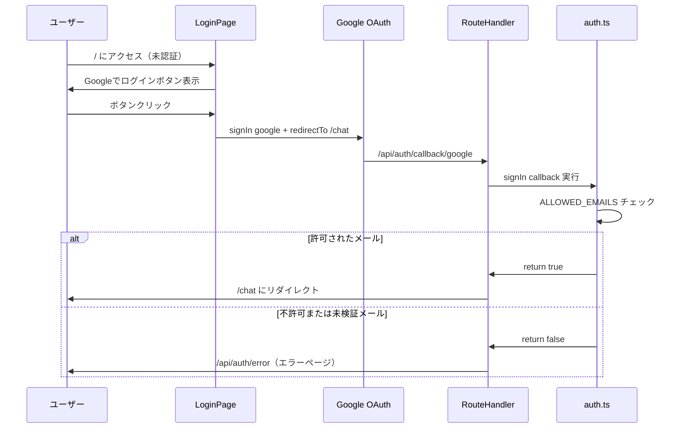
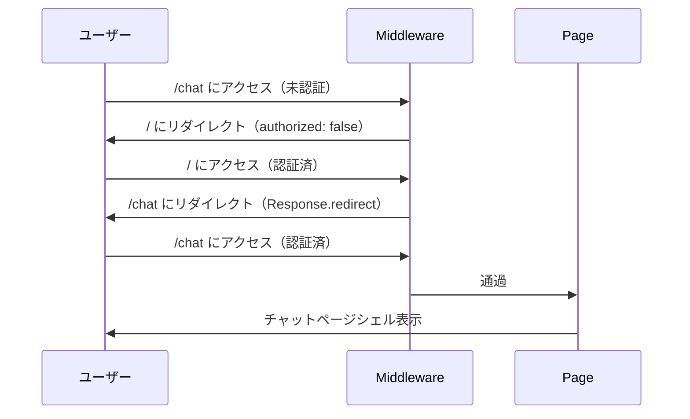

# Design Document: auth

## Overview

`auth` フィーチャーは「my-coach-app」の認証・プロジェクト基盤を担う。Next.js 15 App Router + TypeScript + Tailwind CSS + shadcn/ui でプロジェクト基盤を構築し、NextAuth.js v5（Auth.js）+ Google OAuth で Google アカウントによるログイン・ログアウトを実装する。

`ALLOWED_EMAILS` 環境変数に登録された2名のみがチャット機能にアクセスできるよう `signIn` コールバックで制御する。Middleware の `authorized` コールバックにより、未認証ユーザーのチャット画面へのアクセスを防ぎ、認証済みユーザーをログインページからチャットページへ自動的に誘導する。

### Goals

- Google OAuth ログイン・ログアウトの動作
- `ALLOWED_EMAILS` による2名への利用制限（フェイルセーフ: 未設定時は全ログイン拒否）
- Middleware による `/chat` ルート保護と双方向自動リダイレクト
- 後続 chat-core・session-history スペックが依存できる基盤の確立

### Non-Goals

- チャット UI・AI 返答（chat-core が担当）
- localStorage セッション管理・ドロワー（session-history が担当）
- カスタム認証エラーページ（NextAuth デフォルト `/api/auth/error` を使用）
- データベース認証セッション（JWT 戦略のみ）
- `SessionProvider` / `useSession()` のセットアップ（chat-core が必要に応じて追加）

## Boundary Commitments

### This Spec Owns

- Next.js 15 App Router プロジェクトの初期化・依存パッケージ設定
- shadcn/ui の初期セットアップ
- NextAuth.js v5 設定（`src/auth.config.ts`, `src/auth.ts`）
- Google OAuth プロバイダー設定
- `ALLOWED_EMAILS` による `signIn` コールバックのアクセス制御
- `authorized` コールバックによるルート保護・リダイレクトロジック
- Middleware（`src/middleware.ts`）
- NextAuth.js Route Handler（`src/app/api/auth/[...nextauth]/route.ts`）
- ログインページ UI（`src/app/page.tsx`）
- `/chat` ページシェル（`src/app/chat/page.tsx`）— コンテンツは chat-core が追加
- ログインボタン・ログアウトボタンコンポーネント

### Out of Boundary

- チャット UI コンポーネント・メッセージ一覧（chat-core が担当）
- Gemini API 呼び出し・ストリーミング（chat-core が担当）
- localStorage セッション管理・ドロワー（session-history が担当）
- `SessionProvider` のセットアップ（chat-core が `useSession()` を必要とする場合に追加）
- ログアウト時の localStorage 削除（ADR-002 の決定: 削除しない）

### Allowed Dependencies

- `next@15`（App Router・Server Actions・Middleware）
- `next-auth@5`（Auth.js）
- Google OAuth 2.0 API（外部認証プロバイダー）
- `tailwindcss`, `shadcn/ui`（スタイリング）
- 環境変数: `AUTH_SECRET`, `AUTH_GOOGLE_ID`, `AUTH_GOOGLE_SECRET`, `ALLOWED_EMAILS`

### Revalidation Triggers

- NextAuth.js v5 の `Session` 型変更 → chat-core が `auth()` / `useSession()` を使用する場合に再確認
- `signIn` コールバックの ALLOWED_EMAILS 管理方法変更（DB 化など）→ auth spec の更新が必要
- Middleware の matcher パターン変更（`/chat` 以外のルートを保護する場合）→ 再設計が必要

## Architecture

### Architecture Pattern & Boundary Map

NextAuth.js v5 公式推奨の **Split Config パターン**を採用。Middleware は Edge Runtime で動作するため `auth.config.ts`（Edge 互換）のみを参照し、Google プロバイダーと `signIn` コールバックは Node.js ランタイムの `auth.ts` に配置する。

```mermaid
graph TB
    Browser -->|リクエスト| Middleware

    subgraph EdgeRuntime[Edge Runtime]
        Middleware -->|authorized callback| AuthConfig[auth.config.ts]
    end

    AuthConfig -->|未認証 + /chat → false| SignInRedirect[/ にリダイレクト]
    AuthConfig -->|認証済 + / → redirect| ChatRedirect[/chat にリダイレクト]
    AuthConfig -->|通過| Pages

    subgraph NodeRuntime[Node.js Runtime]
        subgraph Pages
            LoginPage[app/page.tsx]
            ChatShell[app/chat/page.tsx]
        end
        RouteHandler[api/auth/nextauth]
        AuthInstance[auth.ts]
    end

    LoginPage -->|form action signIn| RouteHandler
    RouteHandler -->|signIn callback| AuthInstance
    AuthInstance -->|ALLOWED_EMAILS 照合| AllowCheck{許可?}
    AllowCheck -->|Yes| Session[セッション生成 /chat へ]
    AllowCheck -->|No| ErrorPage[NextAuth エラーページ]

    ChatShell --> LogoutButton[LogoutButton]
    LogoutButton -->|form action signOut| RouteHandler
```

### Technology Stack

| Layer | 採用技術・バージョン | このフィーチャーでの役割 |
|---|---|---|
| フレームワーク | Next.js 15 (App Router + TypeScript) | ページ・Server Actions・Middleware・Route Handler |
| 認証 | next-auth@5（Auth.js） | Google OAuth フロー管理・JWT セッション |
| OAuth Provider | Google OAuth 2.0 | 認証プロバイダー（email 提供・email_verified 保証） |
| UI | Tailwind CSS + shadcn/ui | ログインページのスタイリング・Button コンポーネント |
| Edge Runtime | Vercel Edge / Node.js | Middleware は Edge、Route Handler は Node.js |

## File Structure Plan

### Directory Structure

```
src/
├── auth.config.ts                          # NextAuth 基本設定（Edge 対応）
│                                           # authorized コールバック（route 保護・redirect）
├── auth.ts                                 # NextAuth メインインスタンス
│                                           # handlers, auth, signIn, signOut を export
│                                           # Google プロバイダー + signIn コールバック（ALLOWED_EMAILS）
├── middleware.ts                           # NextAuth(authConfig).auth を export するだけ
├── app/
│   ├── layout.tsx                          # ルートレイアウト（lang="ja", フォント, globals.css）
│   ├── page.tsx                            # ログインページ (/)
│   ├── globals.css                         # Tailwind CSS ディレクティブ
│   ├── chat/
│   │   └── page.tsx                        # チャットページシェル (/chat)
│   │                                       # chat-core がコンテンツを追加する
│   └── api/
│       └── auth/
│           └── [...nextauth]/
│               └── route.ts               # { GET, POST } = handlers
└── components/
    └── auth/
        ├── login-button.tsx               # Googleでログインボタン（form + Server Action）
        └── logout-button.tsx              # ログアウトボタン（form + Server Action）
```

## System Flows

### ログインフロー（要件 2, 3 に対応）



### ルート保護フロー（要件 4 に対応）



## Requirements Traceability

| Requirement | Summary | Components | Notes |
|---|---|---|---|
| 1.1 | アプリがローカルで起動 | Next.js プロジェクト基盤, layout.tsx | create-next-app で解決 |
| 1.2 | 日本語テキスト表示 | layout.tsx (`lang="ja"`) | html lang 属性で対応 |
| 1.3 | UIコンポーネント利用可能 | shadcn/ui セットアップ | `npx shadcn@latest init` |
| 2.1 | Googleでログインボタン表示 | LoginButton, page.tsx | shadcn/ui Button をラップ |
| 2.2 | ボタンクリック → OAuth フロー | LoginButton（form action） | signIn("google", { redirectTo: "/chat" }) |
| 2.3 | 認証完了 → /chat へ遷移 | RouteHandler, auth.ts（signIn cb）| redirectTo: "/chat" + callback true |
| 3.1 | ALLOWED_EMAILS 環境変数管理 | auth.ts（signIn callback） | process.env.ALLOWED_EMAILS カンマ区切り |
| 3.2 | 不許可アカウント → エラーページ | auth.ts（signIn callback） | return false → /api/auth/error |
| 3.3 | 認証エラー → エラーページ | RouteHandler, NextAuth | NextAuth がデフォルトエラーページへ |
| 4.1 | 未認証 + /chat → / へリダイレクト | middleware.ts, auth.config.ts | authorized: false → signIn page (/) |
| 4.2 | 認証済 + / → /chat へリダイレクト | middleware.ts, auth.config.ts | Response.redirect("/chat") |
| 5.1 | ログアウトボタン表示 | LogoutButton, chat/page.tsx | shadcn/ui Button をラップ |
| 5.2 | ログアウト → セッション終了 → / | LogoutButton（form action） | signOut({ redirectTo: "/" }) |

## Components and Interfaces

### Summary Table

| Component | Layer | Intent | Req Coverage | Key Deps (P0) |
|---|---|---|---|---|
| AuthConfig | Config/Edge | NextAuth 基本設定・authorized コールバック | 4.1, 4.2 | next-auth |
| AuthInstance | Config/Node | Google プロバイダー・signIn コールバック・export | 2.2, 2.3, 3.1, 3.2 | next-auth, AuthConfig |
| Middleware | Edge | ルート保護（NextAuth(authConfig).auth を proxy） | 4.1, 4.2 | AuthConfig |
| RouteHandler | API | NextAuth handlers を re-export | 2.2, 2.3, 3.2, 3.3, 5.2 | AuthInstance |
| LoginButton | UI | form + Server Action で signIn("google") | 2.1, 2.2 | AuthInstance.signIn |
| LogoutButton | UI | form + Server Action で signOut() | 5.1, 5.2 | AuthInstance.signOut |
| LoginPage | UI | ログインページ（/）。LoginButton を表示 | 1.1, 1.2, 2.1 | LoginButton |
| ChatShell | UI | /chat シェル。chat-core がコンテンツを追加 | 1.1, 5.1 | LogoutButton |

### Config / Edge Layer

#### AuthConfig (`src/auth.config.ts`)

| Field | Detail |
|---|---|
| Intent | Edge Runtime 対応の NextAuth 基本設定。authorized コールバックでルート保護と双方向リダイレクトを担う |
| Requirements | 4.1, 4.2 |

**Responsibilities & Constraints**
- Edge Runtime 互換のみ（Node.js 固有 API 禁止）
- `authorized` コールバックで /chat の保護と / からの /chat へのリダイレクトを実装
- `pages.signIn: "/"` で未認証ユーザーのデフォルトリダイレクト先を指定

**Contracts**: State ☑

##### State Management

```typescript
import type { NextAuthConfig } from "next-auth";

export const authConfig = {
  providers: [],
  pages: {
    signIn: "/",
  },
  callbacks: {
    authorized({
      auth,
      request: { nextUrl },
    }: {
      auth: { user?: { email?: string | null } } | null;
      request: { nextUrl: URL };
    }): boolean | Response {
      const isLoggedIn = !!auth?.user;
      const isOnChat = nextUrl.pathname.startsWith("/chat");
      const isOnRoot = nextUrl.pathname === "/";

      if (isOnChat && !isLoggedIn) return false; // → / にリダイレクト
      if (isOnRoot && isLoggedIn) {
        return Response.redirect(new URL("/chat", nextUrl));
      }
      return true;
    },
  },
} satisfies NextAuthConfig;
```

**Implementation Notes**
- Integration: `src/auth.ts` と `src/middleware.ts` の両方からインポートされる
- Validation: Google OAuth は `email_verified` を保証するため、authorized コールバックでの追加検証不要
- Risks: `pages.signIn: "/"` が設定されていない場合、NextAuth デフォルトのサインインページ（/api/auth/signin）にリダイレクトされる

---

#### AuthInstance (`src/auth.ts`)

| Field | Detail |
|---|---|
| Intent | NextAuth.js メインインスタンス。Google プロバイダー設定・ALLOWED_EMAILS 照合・handlers / auth / signIn / signOut の export |
| Requirements | 2.2, 2.3, 3.1, 3.2, 3.3, 5.2 |

**Responsibilities & Constraints**
- `authConfig` を spread して Google プロバイダーを追加
- `signIn` コールバックで `ALLOWED_EMAILS` を照合（Node.js ランタイム専用）
- `handlers`, `auth`, `signIn`, `signOut` を export して他コンポーネントに提供
- Node.js ランタイムのみで使用（Middleware からは直接 import しない）

**Contracts**: Service ☑

##### Service Interface

```typescript
import NextAuth from "next-auth";
import Google from "next-auth/providers/google";
import { authConfig } from "@/auth.config";
import type { User, Account, Profile } from "next-auth";

export const { handlers, auth, signIn, signOut } = NextAuth({
  ...authConfig,
  providers: [Google],
  callbacks: {
    ...authConfig.callbacks,
    async signIn({
      user,
      account,
      profile,
    }: {
      user: User;
      account: Account | null;
      profile?: Profile;
    }): Promise<boolean> {
      if (account?.provider !== "google") return false;
      if (!profile?.email_verified) return false;

      const allowedEmails =
        process.env.ALLOWED_EMAILS?.split(",").map((e) => e.trim().toLowerCase()) ?? [];

      return allowedEmails.includes((user.email ?? "").toLowerCase());
    },
  },
});
```

Exported:
- `handlers: { GET: RouteHandler; POST: RouteHandler }` — Route Handler 用
- `auth(): Promise<Session | null>` — Server Component でのセッション取得
- `signIn(provider, options)` — Server Action 用サインイン
- `signOut(options)` — Server Action 用サインアウト

**Implementation Notes**
- Integration: Google プロバイダーを `auth.config.ts` から分離することで Middleware（Edge）が Google SDK を load しない
- Validation: `ALLOWED_EMAILS` 未設定時は `[]` → 全ログイン拒否（フェイルセーフ）
- Validation: `email.toLowerCase()` で大文字小文字不一致を防止
- Risks: `AUTH_GOOGLE_ID` / `AUTH_GOOGLE_SECRET` 未設定時はランタイムエラー → `.env.local.example` に記載必須

---

### Middleware Layer

#### Middleware (`src/middleware.ts`)

| Field | Detail |
|---|---|
| Intent | Edge Runtime でルート保護を実行。authorized コールバックのロジックは auth.config.ts に委譲 |
| Requirements | 4.1, 4.2 |

**Contracts**: Service ☑

##### Service Interface

```typescript
import NextAuth from "next-auth";
import { authConfig } from "@/auth.config";

export default NextAuth(authConfig).auth;

export const config = {
  matcher: ["/((?!api|_next/static|_next/image|favicon.ico).*)"],
};
```

**Implementation Notes**
- Integration: `authConfig` の `authorized` コールバックがすべての判定を担う
- Risks: matcher が広すぎると API ルートも保護される — `api` を除外することで NextAuth 自身の `/api/auth/*` エンドポイントが正常動作する

---

### API Layer

#### RouteHandler (`src/app/api/auth/[...nextauth]/route.ts`)

| Field | Detail |
|---|---|
| Intent | NextAuth.js の OAuth コールバック・セッション管理エンドポイント |
| Requirements | 2.2, 2.3, 3.2, 3.3, 5.2 |

**Contracts**: API ☑

##### API Contract

| Method | Endpoint | 役割 |
|---|---|---|
| GET/POST | /api/auth/signin/google | Google OAuth フロー開始 |
| GET | /api/auth/callback/google | OAuth コールバック（signIn callback 実行） |
| GET/POST | /api/auth/signout | サインアウト処理 |
| GET | /api/auth/session | セッション JSON 取得 |
| GET | /api/auth/error | 認証エラーページ |

```typescript
import { handlers } from "@/auth";
export const { GET, POST } = handlers;
```

---

### UI Layer

#### LoginButton (`src/components/auth/login-button.tsx`)

Summary-only — shadcn/ui の `Button` をラップし、`form` + Server Action で `signIn("google", { redirectTo: "/chat" })` を呼び出す。JavaScript 無効環境でも動作するフォーム送信方式を採用。

```typescript
import { signIn } from "@/auth";
import { Button } from "@/components/ui/button";

export function LoginButton() {
  return (
    <form
      action={async () => {
        "use server";
        await signIn("google", { redirectTo: "/chat" });
      }}
    >
      <Button type="submit">Google でログイン</Button>
    </form>
  );
}
```

#### LogoutButton (`src/components/auth/logout-button.tsx`)

Summary-only — shadcn/ui の `Button` をラップし、`form` + Server Action で `signOut({ redirectTo: "/" })` を呼び出す。ADR-002 に従いログアウト時に localStorage は削除しない（アプリコードでの操作なし）。

```typescript
import { signOut } from "@/auth";
import { Button } from "@/components/ui/button";

export function LogoutButton() {
  return (
    <form
      action={async () => {
        "use server";
        await signOut({ redirectTo: "/" });
      }}
    >
      <Button type="submit" variant="ghost">
        ログアウト
      </Button>
    </form>
  );
}
```

#### LoginPage (`src/app/page.tsx`)

Summary-only — Server Component。アプリ説明テキストと `LoginButton` を表示。Middleware により認証済みユーザーはこのページを見る前に `/chat` へリダイレクトされる。

#### ChatShell (`src/app/chat/page.tsx`)

Summary-only — Server Component。`LogoutButton` を含む最小限のシェル。チャット UI・メッセージ一覧・入力欄は chat-core スペックが追加する。Middleware により未認証ユーザーはアクセス不可。

#### RootLayout (`src/app/layout.tsx`)

Summary-only — `lang="ja"` 属性、Tailwind CSS グローバルスタイル、Google Fonts（必要に応じて）を設定。SessionProvider は含めない（chat-core が必要に応じて追加する）。

---

## Error Handling

### Error Strategy

| エラー種別 | 発生箇所 | 対応 |
|---|---|---|
| 不許可メールアドレス（signIn return false） | auth.ts signIn callback | NextAuth → `/api/auth/error`（デフォルトエラーページ） |
| 未検証メール（email_verified: false） | auth.ts signIn callback | 同上 |
| Google OAuth 通信エラー | Google OAuth API | NextAuth → `/api/auth/error` |
| ALLOWED_EMAILS 未設定 | auth.ts signIn callback | 空配列扱い → 全ログイン拒否（フェイルセーフ） |
| AUTH_GOOGLE_ID / SECRET 未設定 | アプリ起動時 | Next.js ランタイムエラー → `.env.local.example` で対応 |
| JWT 検証失敗（AUTH_SECRET 不正） | Middleware | セッション無効 → authorized: false → / にリダイレクト |

## Testing Strategy

### Unit Tests

1. **signIn callback: 許可メール** — ALLOWED_EMAILS に含まれるアドレスで呼ぶ → `true`
2. **signIn callback: 不許可メール** — ALLOWED_EMAILS に含まれないアドレスで呼ぶ → `false`
3. **signIn callback: ALLOWED_EMAILS 未設定** — 環境変数なしで呼ぶ → `false`（フェイルセーフ）
4. **signIn callback: 大文字小文字** — `User@Gmail.com` vs `user@gmail.com` → 一致する

### Integration Tests

5. **Middleware: 未認証 + /chat** — 未認証リクエストで `/chat` → 302 `/` レスポンス
6. **Middleware: 認証済 + /** — 有効セッションで `/` → 302 `/chat` レスポンス
7. **Middleware: 認証済 + /chat** — 有効セッションで `/chat` → 通過（200）

### E2E Tests

8. **ログインフロー（許可アカウント）** — 許可メールの Google アカウントでログイン → `/chat` シェルが表示される
9. **ログインフロー（不許可アカウント）** — 不許可メールでログイン試行 → エラーページが表示される
10. **ログアウトフロー** — `/chat` でログアウトボタンをクリック → `/` にリダイレクトされる
11. **ルート保護** — 未ログイン状態で `/chat` に直接アクセス → `/` にリダイレクトされる

## Security Considerations

- `AUTH_SECRET` は最低 32 文字のランダム文字列を使用（`openssl rand -base64 32` で生成）
- `AUTH_GOOGLE_ID`, `AUTH_GOOGLE_SECRET`, `ALLOWED_EMAILS`, `AUTH_SECRET` は `.env.local` で管理し、`.gitignore` に追加
- Google Cloud Console の OAuth アプリは「テストモード」で2名のテストユーザーのみを許可
- JWT 戦略のみ使用（DB なし）— セッション有効期限は NextAuth デフォルト（30日）を適用
- `ALLOWED_EMAILS` フェイルセーフ: 環境変数未設定時は全ログイン拒否（空許可リスト）
- ログアウト時に localStorage を削除しない（ADR-002 に従う）
