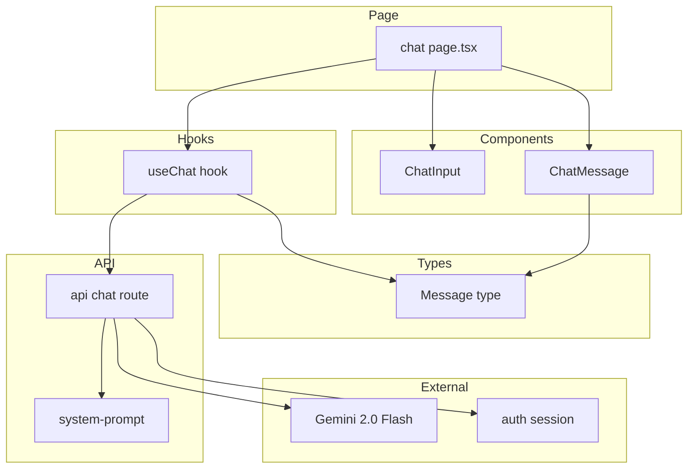
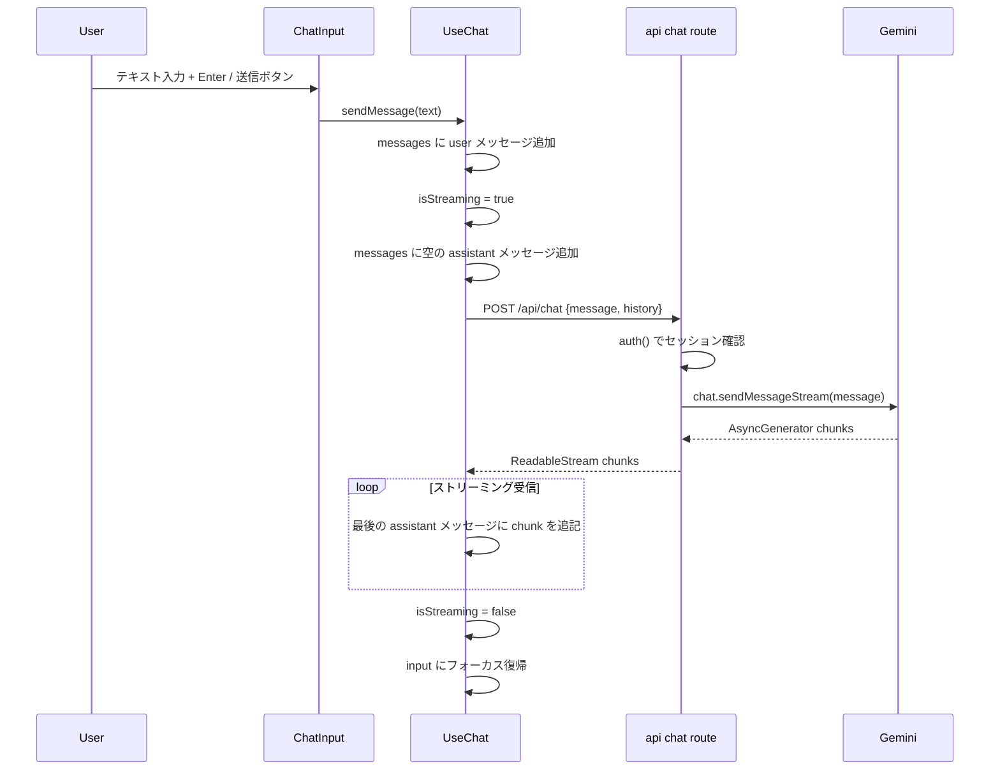
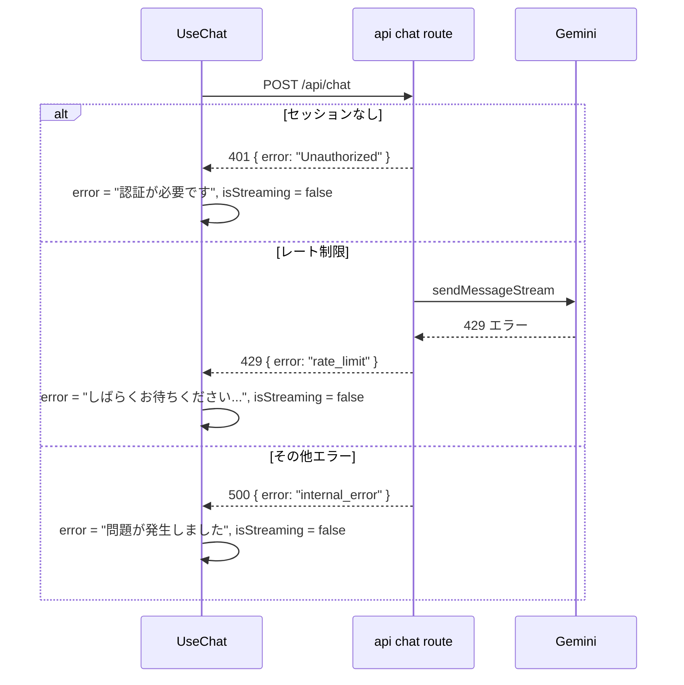

# Design Document: chat-core

## Overview

chat-core フィーチャーは、認証済みの中学生ユーザーが `/chat` ページでテキストメッセージを送信し、AI コーチから Markdown 形式のリアルタイムストリーミング返答を受け取ることができるチャット UI を実装する。AI は生徒の思考を促すコーチング動作（答えを直接教えない）をシステムプロンプトで実現する。

auth スペックが構築した `/chat` のシェルページにチャット UI コンポーネント群を追加し、`/api/chat` Route Handler を新設して Gemini 2.0 Flash との接続を確立する。session-history スペックがこのフィーチャーの `Message` 型と `useChat` フックのインターフェースを利用するため、それらの公開契約を安定させることがこの設計の重要な責務となる。

### Goals

- テキスト入力・送信・ストリーミング受信・Markdown レンダリングが動作するマルチターンチャット
- AI がコーチング形式（ヒント・問いかけ）で応答するシステムプロンプト管理
- レート制限エラー等に対する適切なエラー表示と UI 復帰

### Non-Goals

- メッセージの永続化・復元（session-history が担当）
- セッション切り替えとドロワー UI（session-history が担当）
- 「新しい会話」ボタン（session-history が担当）
- 認証・ルート保護（auth が担当）

## Boundary Commitments

### This Spec Owns

- `Message` 型の定義（`src/types/message.ts`）— session-history との共有契約
- `useChat` フックの公開インターフェース（`messages`, `isStreaming`, `error`, `sendMessage`）
- `/api/chat` Route Handler（認証チェック、Gemini 呼び出し、ストリーミングレスポンス）
- チャット UI コンポーネント（`ChatMessage`, `ChatInput`）
- コーチング用システムプロンプト（`src/lib/system-prompt.ts`）
- ストリーミング中の UI 制御（disabled 状態）
- エラー表示（レート制限、通信エラー）

### Out of Boundary

- `messages` 配列の localStorage への保存（session-history が追加する）
- 「新しい会話」ボタンとセッション初期化ロジック（session-history が追加する）
- セッション一覧ドロワー（session-history が追加する）
- `/chat` ページの `LogoutButton` とページ基盤（auth が提供済み）

### Allowed Dependencies

- `src/auth` — Route Handler でのセッション確認（`auth()` 関数）
- `src/components/ui/button.tsx` — shadcn/ui Button コンポーネント
- `src/components/auth/logout-button.tsx` — 既存コンポーネント（修正しない）
- `@google/genai` — Gemini API クライアント（新規インストール）
- `react-markdown` + `remark-gfm` — Markdown レンダリング（新規インストール）

### Revalidation Triggers

- `Message` 型の shape 変更（role や content フィールドの追加・変更）→ session-history の再検証が必要
- `useChat` フックの公開インターフェース変更（`messages`/`sendMessage` の型変更）→ session-history の再検証が必要
- `/api/chat` リクエスト/レスポンス shape の変更 → フロントエンドと Route Handler の両方を再検証

## Architecture

### Architecture Pattern & Boundary Map



**依存方向**: `Types` → `Lib/Config` → `API` → `Hooks` → `Components` → `Page`。下位層から上位層へのインポートは禁止。

### Technology Stack

| Layer | Choice / Version | Role | Notes |
|-------|-----------------|------|-------|
| Frontend | React 19 / Next.js 16 | チャット UI / クライアント状態 | 既存スタック |
| State Management | Custom `useChat` hook | ストリーミング状態・メッセージ管理 | Vercel AI SDK 不使用（後述） |
| Markdown | react-markdown 10.1.0 + remark-gfm | AI 返答レンダリング | 'use client' 必須 |
| AI API | @google/genai 2.10.0 | Gemini 2.0 Flash 呼び出し | 旧 @google/generative-ai は廃止 |
| Streaming | Web Streams API（ReadableStream） | Route Handler → クライアント | Edge Runtime 不可（Node.js Runtime 使用）|
| Auth | next-auth v5 `auth()` | Route Handler でのセッション確認 | 既存スタック |

> Vercel AI SDK は不採用。カスタム `fetch` + `ReadableStream` で十分な機能を実現でき、依存を最小化できる。詳細は research.md 参照。

## File Structure Plan

### Directory Structure

```
src/
├── types/
│   └── message.ts              # Message 型定義（session-history との共有契約）
├── lib/
│   └── system-prompt.ts        # AI コーチング用システムプロンプト定数
├── hooks/
│   └── use-chat.ts             # チャット状態・送信・ストリーミング管理
├── components/
│   └── chat/
│       ├── chat-message.tsx    # メッセージバブル + Markdown レンダリング
│       └── chat-input.tsx      # テキストエリア + 送信ボタン
└── app/
    ├── api/
    │   └── chat/
    │       └── route.ts        # POST /api/chat（Gemini ストリーミング）
    └── chat/
        └── page.tsx            # 修正: UI コンポーネントを統合
```

### Modified Files

- `src/app/chat/page.tsx` — プレースホルダーを削除し、`useChat` フック + `ChatMessage` + `ChatInput` を統合したチャット UI を実装する
- `.env.local.example` — `GEMINI_API_KEY` エントリを追加する

## System Flows

### メッセージ送信とストリーミング受信



### エラーフロー（レート制限 / 認証エラー）



## Requirements Traceability

| 要件 | 概要 | コンポーネント | インターフェース |
|------|------|--------------|----------------|
| 1.1 | 入力欄・送信ボタン表示 | ChatInput, chat/page.tsx | ChatInputProps |
| 1.2 | 送信ボタンクリック → 送信 | ChatInput, useChat | ChatInputProps.onSubmit |
| 1.3 | Enter キー → 送信 | ChatInput | キーボードイベントハンドラ |
| 1.4 | Shift+Enter → 改行 | ChatInput | キーボードイベントハンドラ |
| 1.5 | 空入力 → 送信しない | useChat | sendMessage のガード |
| 2.1 | バブル形式表示 | ChatMessage | ChatMessageProps |
| 2.2 | ユーザーメッセージ即時表示 | useChat | sendMessage（楽観的追加） |
| 2.3 | マルチターン | useChat, /api/chat | history パラメータ |
| 3.1 | AI 返答開始 | useChat, /api/chat | POST /api/chat |
| 3.2 | コーチング動作 | system-prompt.ts, /api/chat | SYSTEM_PROMPT 定数 |
| 3.3 | リアルタイムストリーミング表示 | useChat | ReadableStream 受信ループ |
| 4.1 | Markdown レンダリング | ChatMessage | react-markdown |
| 5.1 | 生成中は disabled | useChat, ChatInput | isStreaming → disabled prop |
| 5.2 | 完了後に操作可能 | useChat | isStreaming = false |
| 6.1 | レート制限エラーメッセージ | useChat, /api/chat | 429 → error state |
| 6.2 | その他エラーメッセージ | useChat, /api/chat | 500 → error state |
| 6.3 | エラー後に入力復帰 | useChat | finally: isStreaming = false |

## Components and Interfaces

### コンポーネントサマリー

| コンポーネント | Domain/Layer | Intent | 要件 | Key Dependencies |
|--------------|--------------|--------|------|-----------------|
| Message（型）| Types | ユーザー/AI メッセージの共有型 | 2.1, 2.3, 3.3 | なし（P0: 全体の基盤） |
| SYSTEM_PROMPT | Lib/Config | コーチング動作ルール定数 | 3.2 | なし |
| /api/chat | API | Gemini ストリーミング Route Handler | 3.1, 3.2, 3.3, 6.1, 6.2, 6.3 | @google/genai (P0), auth (P0) |
| useChat | Hook | チャット状態・ストリーミング管理 | 1.2-1.5, 2.2, 2.3, 3.1, 3.3, 5.1, 5.2, 6.1-6.3 | Message, /api/chat (P0) |
| ChatMessage | UI | メッセージバブル + Markdown | 2.1, 4.1 | Message, react-markdown (P0) |
| ChatInput | UI | テキスト入力・送信 | 1.1-1.5, 5.1 | Button (P1) |
| chat/page.tsx | Page | UI 統合 | 1.1, 2.1 | useChat, ChatMessage, ChatInput (P0) |

---

### Types

#### Message

| Field | Detail |
|-------|--------|
| Intent | ユーザーと AI のメッセージを表す共有型 |
| Requirements | 2.1, 2.3, 3.3 |

**Contracts**: State [✓]

##### State Management

```typescript
// src/types/message.ts
export interface Message {
  role: "user" | "assistant";
  content: string;
}
```

- `role: "user"` — ユーザーが送信したメッセージ
- `role: "assistant"` — AI コーチの返答
- `content` — テキスト内容（Markdown を含む場合あり）

**Implementation Notes**
- この型は session-history スペックが localStorage 保存に使用する公開契約。shape の変更は Revalidation Trigger。
- Gemini API の history は `role: "model"` を使用するため、Route Handler 内でマッピングを行う（`"assistant"` → `"model"`）。この変換はクライアント側に露出しない。

---

### Lib/Config

#### SYSTEM_PROMPT

| Field | Detail |
|-------|--------|
| Intent | AI コーチのコーチング動作ルールを定義する定数 |
| Requirements | 3.2 |

**Contracts**: State [✓]

```typescript
// src/lib/system-prompt.ts
export const SYSTEM_PROMPT = `あなたは中学生の学習をサポートする AI コーチです。
以下のルールを必ず守ってください：

1. 問題の答えを直接教えてはいけません
2. ヒントや問いかけを使って、生徒が自分で考えられるよう導いてください
3. 「どこで詰まっていますか？」「何を試してみましたか？」など、思考を促す質問をしてください
4. 生徒が正しい方向に進んでいるときは、励ましの言葉をかけてください
5. 中学生にわかりやすい言葉を使ってください
6. 返答は Markdown 形式で書いてください（箇条書き・太字・コードブロックなど）`;
```

---

### API

#### /api/chat Route Handler

| Field | Detail |
|-------|--------|
| Intent | 認証確認・Gemini 呼び出し・ストリーミングレスポンスの Route Handler |
| Requirements | 3.1, 3.2, 3.3, 6.1, 6.2, 6.3 |

**Responsibilities & Constraints**
- Node.js Runtime（Edge Runtime 不可：`@google/genai` は Node.js API に依存）
- `auth()` でセッションを確認し、未認証は 401 を返す
- `/api/*` パスは Middleware の matcher 除外対象のため、Route Handler 内での明示的な認証確認が必須
- 会話履歴（`history`）は各リクエストでクライアントから送信されるステートレス設計

**Dependencies**
- Inbound: useChat フック — メッセージと履歴の送信（P0）
- Outbound: auth() — セッション確認（P0）
- Outbound: SYSTEM_PROMPT — コーチング指示（P0）
- External: @google/genai 2.10.0 — Gemini API（P0）

**Contracts**: API [✓]

##### API Contract

| Method | Endpoint | Request Body | Response | Errors |
|--------|----------|-------------|----------|--------|
| POST | /api/chat | `ChatRequest` | `ReadableStream` text/plain | 401, 429, 500 |

```typescript
// Request
interface ChatRequest {
  message: string;        // 新しいユーザーメッセージ
  history: Message[];     // これまでの会話履歴（全メッセージ）
}

// Success Response
// Content-Type: text/plain; charset=utf-8
// Body: ストリーミングテキストチャンク

// Error Response
interface ChatErrorResponse {
  error: "Unauthorized" | "rate_limit" | "internal_error";
  message?: string;       // ユーザー向けメッセージ（オプション）
}
```

**実装イメージ（設計参照用）:**
```typescript
// src/app/api/chat/route.ts
export async function POST(req: NextRequest): Promise<Response> {
  const session = await auth();
  if (!session) return Response.json({ error: "Unauthorized" }, { status: 401 });

  const { message, history }: ChatRequest = await req.json();

  const ai = new GoogleGenAI({ apiKey: process.env.GEMINI_API_KEY! });
  const geminiHistory = history.map(msg => ({
    role: msg.role === "assistant" ? "model" : "user" as const,
    parts: [{ text: msg.content }],
  }));

  try {
    const chat = ai.chats.create({
      model: "gemini-2.0-flash",
      history: geminiHistory,
      config: { systemInstruction: SYSTEM_PROMPT },
    });

    const stream = await chat.sendMessageStream({ message });
    const encoder = new TextEncoder();

    const readable = new ReadableStream({
      async start(controller) {
        for await (const chunk of stream) {
          const text = chunk.text ?? "";
          if (text) controller.enqueue(encoder.encode(text));
        }
        controller.close();
      },
    });

    return new Response(readable, {
      headers: { "Content-Type": "text/plain; charset=utf-8" },
    });
  } catch (error: unknown) {
    if (isRateLimitError(error)) {
      return Response.json({ error: "rate_limit" }, { status: 429 });
    }
    return Response.json({ error: "internal_error" }, { status: 500 });
  }
}
```

**Implementation Notes**
- レート制限エラーの判定: `@google/genai` が投げるエラーのメッセージや status が 429 を含む場合
- ストリーミング開始後（HTTP 200 送信後）のエラーはステータスコード変更不可。ストリームが切れた場合はクライアント側で検出

---

### Hooks

#### useChat

| Field | Detail |
|-------|--------|
| Intent | メッセージ状態・ストリーミング受信・エラー管理を担うカスタムフック |
| Requirements | 1.2, 1.3, 1.4, 1.5, 2.2, 2.3, 3.1, 3.3, 5.1, 5.2, 6.1, 6.2, 6.3 |

**Responsibilities & Constraints**
- `'use client'` 指定必須（React state と fetch を使用）
- session-history スペックはこのフックの `messages`, `isStreaming`, `sendMessage` を利用して永続化・セッション管理を追加する
- フックは内部状態（`messages`）を管理するが、永続化は行わない

**Contracts**: Service [✓] / State [✓]

##### Service Interface

```typescript
// src/hooks/use-chat.ts
export interface UseChatReturn {
  messages: Message[];
  isStreaming: boolean;
  error: string | null;
  sendMessage: (text: string) => Promise<void>;
}

export function useChat(): UseChatReturn;
```

**sendMessage の動作仕様:**
1. `text` が空の場合は即時リターン（要件 1.5）
2. `messages` にユーザーメッセージを追加（楽観的更新、要件 2.2）
3. `isStreaming = true`、`error = null`
4. `messages` に `{ role: "assistant", content: "" }` を追加（要件 3.3）
5. `POST /api/chat` を `fetch` で呼び出す（`message` + 現在の `messages` を `history` として送信）
6. `response.body` から `ReadableStream` を読み込み、チャンクを最後の assistant メッセージに追記
7. 完了: `isStreaming = false`（要件 5.2）
8. エラー: 適切な `error` 文字列を設定し、`isStreaming = false`（要件 6.1, 6.2, 6.3）

---

### UI Components

#### ChatMessage（プレゼンテーション）

| Field | Detail |
|-------|--------|
| Intent | ユーザー/AI メッセージのバブル表示と Markdown レンダリング |
| Requirements | 2.1, 4.1 |

```typescript
// src/components/chat/chat-message.tsx
interface ChatMessageProps {
  message: Message;
}
```

- `'use client'` 指定必須（react-markdown が Client Component を要求）
- `message.role === "user"` と `"assistant"` でバブルスタイルを切り替え
- AI メッセージは `react-markdown` + `remarkGfm` でレンダリング
- ユーザーメッセージはプレーンテキスト（XSS を避けるため Markdown 非適用）

#### ChatInput（プレゼンテーション）

| Field | Detail |
|-------|--------|
| Intent | テキスト入力欄と送信ボタン |
| Requirements | 1.1, 1.2, 1.3, 1.4, 1.5, 5.1 |

```typescript
// src/components/chat/chat-input.tsx
interface ChatInputProps {
  onSubmit: (text: string) => void;
  disabled: boolean;
}
```

- `'use client'` 指定必須（ブラウザイベント処理）
- `textarea` を使用（`input` では改行できないため）
- `onKeyDown`: Enter のみ → `onSubmit`、Shift+Enter → デフォルト改行（要件 1.3, 1.4）
- `disabled` が `true` の間は `textarea` と送信ボタンを無効化（要件 5.1）
- 送信後に `textarea` を空にし、フォーカスを戻す

---

## Data Models

### Domain Model

```typescript
// src/types/message.ts
export interface Message {
  role: "user" | "assistant";
  content: string;
}
```

**不変条件:**
- `role` は `"user"` または `"assistant"` のみ（Gemini API の `"model"` への変換は Route Handler が行う）
- `content` は空文字列を許容（ストリーミング中の AI メッセージの初期状態）

### Data Contracts & Integration

**POST /api/chat リクエスト:**
```typescript
{
  message: string;      // 新しいユーザーの入力
  history: Message[];   // 会話履歴（最新のユーザーメッセージは含まない）
}
```

**Gemini API へのマッピング（Route Handler 内部）:**
```typescript
// Message → Gemini Content
{
  role: "user" | "model",   // "assistant" → "model" に変換
  parts: [{ text: string }]
}
```

## Error Handling

### Error Strategy

ユーザーに対してエラーの原因と次の行動を明示するメッセージを表示し、入力欄を操作可能な状態に戻す（要件 6.3）。ストリーミング開始前にエラーを検出して HTTP エラーレスポンスを返す。

### Error Categories and Responses

| エラー | HTTP | ユーザー向けメッセージ | UI 復帰 |
|--------|------|----------------------|---------|
| 未認証（セッションなし） | 401 | 「再度ログインしてください」 | isStreaming = false |
| レート制限（Gemini 429） | 429 | 「リクエストが多すぎます。しばらく待ってから再試行してください」 | isStreaming = false |
| その他 API エラー | 500 | 「エラーが発生しました。もう一度試してください」 | isStreaming = false |
| ストリーム中断 | — | 「接続が途切れました。もう一度試してください」 | isStreaming = false |

## Testing Strategy

### Unit Tests

- `useChat.sendMessage`: 空入力ガード（要件 1.5）— `messages` が更新されないことを確認
- `useChat.sendMessage`: エラーレスポンス（401/429/500）→ `error` 状態と `isStreaming = false` を確認（要件 6.1, 6.2, 6.3）
- `useChat`: ストリーミング中の `isStreaming` 状態管理（要件 5.1, 5.2）

### Integration Tests

- `POST /api/chat`: 未認証リクエスト → 401 を返す（要件 3.1）
- `POST /api/chat`: 認証済みリクエスト → ストリーミングレスポンスを返す（要件 3.1, 3.3）
- `ChatInput`: Enter キー → `onSubmit` 呼び出し（要件 1.3）
- `ChatInput`: Shift+Enter → `onSubmit` 非呼び出し（要件 1.4）

### E2E Tests（オプション）

- ユーザーがメッセージを送信すると AI 返答がストリーミングで表示される
- エラー時に入力欄が操作可能に戻る

## Security Considerations

- `GEMINI_API_KEY` は `.env.local` で管理（`.gitignore` 対象）。`.env.local.example` に記載例を追加する
- Route Handler は必ず `auth()` でセッション確認。未認証は 401 を返す（`/api` は Middleware の matcher 除外対象のため必須）
- ユーザーメッセージは Gemini API にそのまま送信されるが、Markdown レンダリング対象は AI 返答のみとし、ユーザーメッセージはプレーンテキスト表示（XSS 対策）
