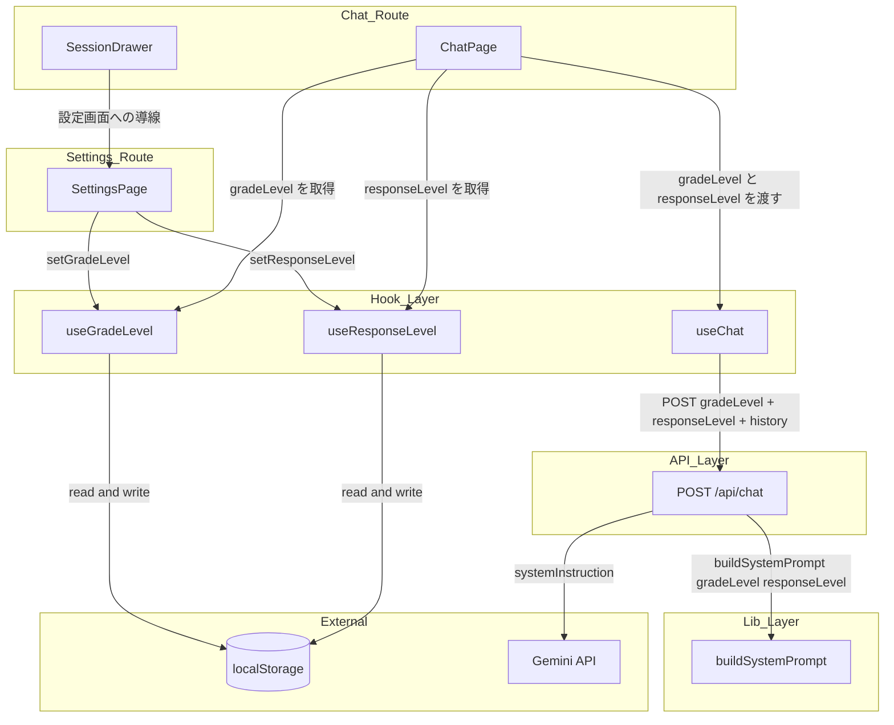
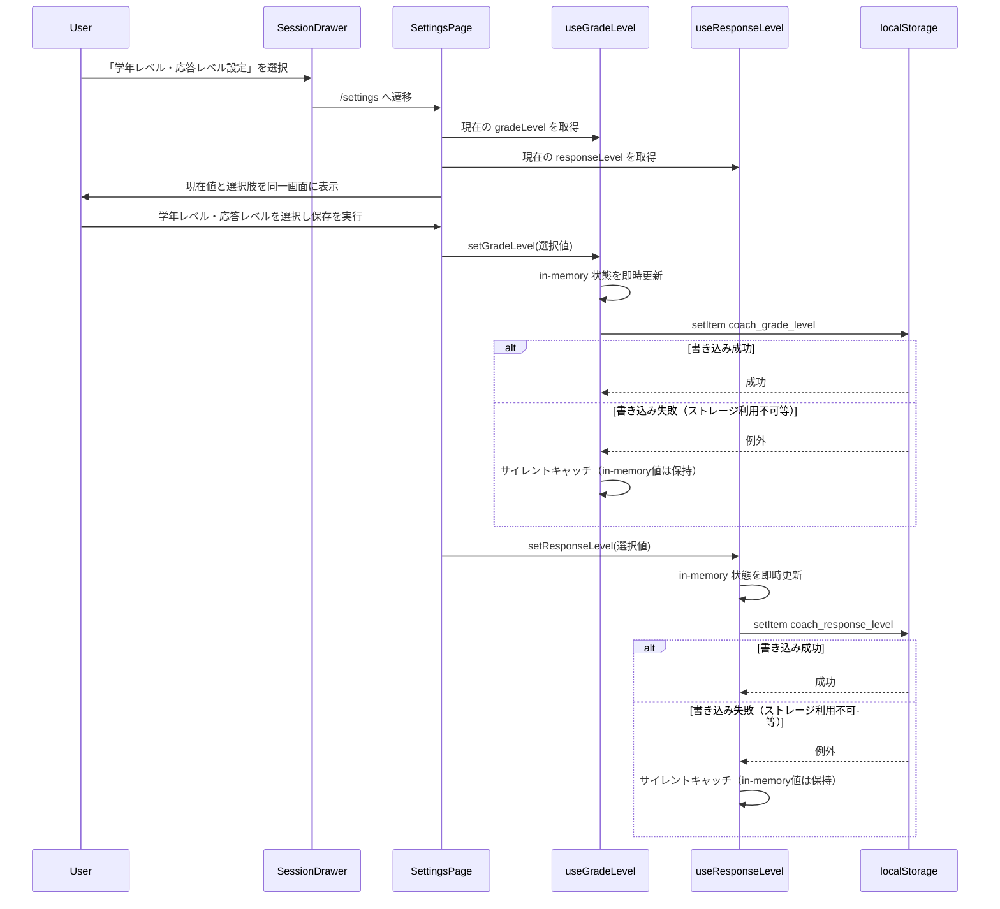
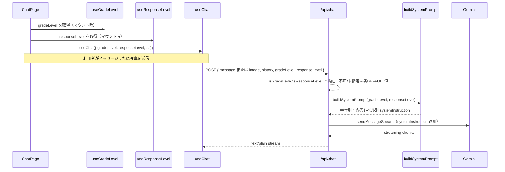

# Design Document: grade-level-coaching

## Overview

学習支援チャットアプリ「my-coach-app」に、利用者が学年レベル（中学生 / 高校生）と応答レベル（基本 / 応用）を設定し、AI コーチがその組み合わせに応じて説明の難易度・語彙・ヒントの発展度合いを調整する機能を追加する。学年レベル機能は既に実装済みであり、本設計は同一の `/settings` 画面・チャット送信フローに応答レベルを統合する形で拡張する。利用者は専用の `/settings` 画面から学年レベル・応答レベルをいつでも確認・変更でき、チャット画面のドロワーメニューから導線を提供する。

既存の chat-core / session-history スペックを拡張する形で実装する。応答レベルは学年レベルと同型のパターン（端末単位の localStorage 保存、`use-session-storage` と同じ SSR 安全パターン）を踏襲した独立コンポーネントとして追加する（`research.md` Option B）。AI コーチングへの反映は、`buildSystemPrompt(gradeLevel)` を `buildSystemPrompt(gradeLevel, responseLevel)` に拡張し、`/api/chat` がリクエストボディで受け取った学年レベル・応答レベルの両方を Gemini の `systemInstruction` 内の独立した指示行として反映することで実現する。新規外部依存は発生しない。

### Goals

- 学年レベル（中学生 / 高校生）を専用設定画面で選択・保存・変更できるようにする（既存実装済み）
- 応答レベル（基本 / 応用）を、学年レベルと同一の設定画面で選択・保存・変更できるようにする
- チャット画面から設定画面への導線を提供する（既存実装済み、導線ラベルを応答レベル追加に合わせて更新）
- AI コーチの説明を学年レベルに応じて調整する（既存実装済み、ヒント中心コーチング方針は維持）
- AI コーチのヒントの発展度合いを応答レベルに応じて調整する（学年レベルが定める語彙・既習範囲の制約は維持したまま）
- 学年レベル・応答レベルいずれの保存に失敗してもチャット機能をブロックしない（互いに独立して継続動作する）

### Non-Goals

- 学年レベル・応答レベル以外のプロフィール項目（氏名・学校名など）の追加
- 中学生・高校生以外の学年区分（大学生など）への対応
- 基本・応用以外の応答レベル区分（超発展・復習専用など）の追加
- 学年レベルと応答レベルの組み合わせごとに個別の文言テンプレートを外部設定可能にすること
- アカウント単位でのサーバー側永続化・複数デバイス間での設定同期
- 会話履歴（Message/Session）への学年レベル・応答レベルの記録・復元

---

## Boundary Commitments

### This Spec Owns

- `GradeLevel` 型・デフォルト値・バリデータ（`src/types/grade-level.ts`、既存）
- `ResponseLevel` 型・デフォルト値・バリデータ（`src/types/response-level.ts`、新規）
- 学年レベルの localStorage 読み書きフック（`use-grade-level`、既存）
- 応答レベルの localStorage 読み書きフック（`use-response-level`、新規）
- 学年レベル・応答レベルを同一画面で扱う設定画面（`/settings` ページ）
- チャット画面（ドロワー）から設定画面への導線
- `buildSystemPrompt(gradeLevel, responseLevel)` のシグネチャと生成ロジック
- `/api/chat` ルートの `gradeLevel` / `responseLevel` フィールド受け付け・検証・`buildSystemPrompt` への反映
- `useChat` フックの `gradeLevel` / `responseLevel` 送信対応

### Out of Boundary

- 認証・ルート保護（auth スペックの責務。`/settings` は既存 middleware の matcher により自動的に保護対象となるが、保護ロジック自体は変更しない）
- セッション履歴の永続化・表示ロジック（session-history スペックの責務。`Message`/`Session` 型は変更しない）
- 学年レベル・応答レベルのサーバー側永続化・アカウント単位の同期（将来的に auth スペックがアカウント基盤を持つ場合の拡張候補、本スペックのスコープ外）
- 基本・応用以外の応答レベル区分の追加
- 学年レベルと応答レベルの組み合わせごとの個別文言テンプレートの外部設定可能化
- 画像コーチング機能そのもの（image-coaching スペックの責務。`SYSTEM_PROMPT` 内の写真コーチング指示は維持するのみで変更しない）

### Allowed Dependencies

- localStorage（ブラウザネイティブ、既存キー `coach_grade_level` + 新規キー `coach_response_level`）
- `src/lib/system-prompt.ts`（所有して拡張）
- `src/app/api/chat/route.ts`（所有して拡張）
- `src/hooks/use-chat.ts`（所有して拡張）
- `src/components/session/session-drawer.tsx`（設定画面への導線ラベルを更新）
- `src/app/chat/page.tsx`（`use-response-level` を `useChat` に接続）
- `src/app/settings/page.tsx`（応答レベルの表示・選択・保存を統合）
- Next.js App Router（既存 `/settings` ルートを拡張。ルート新設なし）

### Revalidation Triggers

- `Message` / `Session` 型に学年レベル・応答レベルを含める変更が発生する場合 → session-history スペックとの境界の見直しが必要（本設計では発生しない）
- 学年レベル・応答レベルのサーバー側永続化・アカウント単位の同期を導入する場合 → auth スペックとの契約定義が必要
- `SYSTEM_PROMPT` / `buildSystemPrompt` の構造変更（image-coaching が追記した写真コーチング指示との統合方法変更）→ 両スペックの整合性確認が必要
- `/api/chat` の `ChatRequest` 形式変更 → `useChat` との契約検証が必要
- `SettingsPage` の保存ボタンを単一から個別に分離する変更を行う場合 → 本設計の「単一保存ボタン」決定（下記 Key Decisions 参照）の再検証が必要
- 3つ目の設定軸（学年レベル・応答レベルに続く項目）を追加する場合 → `useGradeLevel`/`useResponseLevel` を単一フックへ統合すべきかを再検討する必要（`research.md` Option C 参照）

---

## Architecture

### Existing Architecture Analysis

現在の `/chat` ページは `useChat`（送受信）と `useSessionStorage`（会話永続化）を組み合わせ、`/api/chat` が認証済みセッションを前提に Gemini とのストリーミングを仲介する。学年レベル機能（本スペックの初期実装）は稼働済みであり、`/settings` ページ・`useGradeLevel` フック・`buildSystemPrompt(gradeLevel)` が確立している。設定画面は学年レベル専用の単一 `selected: GradeLevel` state + 単一保存ボタンという構造を持つ。

本拡張はこの既存パターンを次の2点で拡張する:
- **既存パターンの複製による新規のローカル設定領域**: `use-response-level` フックが、既存の `use-grade-level` と全く同じ localStorage パターン（SSR 安全な同期初期化、書き込み失敗のサイレントキャッチ）に従い、独立した永続化領域（`coach_response_level`）を持つ（`research.md` Option B）
- **既存フローへの値の注入**: `useChat` が送信時に `gradeLevel` に加え `responseLevel` をリクエストボディに含め、`/api/chat` が `buildSystemPrompt(gradeLevel, responseLevel)` を呼び出して Gemini の `systemInstruction` を切り替える

### Architecture Pattern & Boundary Map



**Key Decisions**:
- 応答レベルは学年レベルと全く同型の独立コンポーネント（型・フック）として追加する。既存の `useGradeLevel` 自体は変更せず、実装済み部分への手戻りを避ける（`research.md` Option B、Design Decision: ResponseLevel の列挙値命名）
- `SettingsPage` は学年レベル・応答レベルの2つの選択状態を保持するが、保存操作は単一の保存ボタンに統合する。`setGradeLevel`・`setResponseLevel` はそれぞれ独立した localStorage キー・独立した try/catch を持つため、単一ボタンから両方を呼び出しても一方の保存失敗が他方に波及しない（Req 4.1, 4.2 の独立性が保たれる。`research.md` Design Decision: SettingsPage の保存操作の粒度）
- `buildSystemPrompt` は学年レベル（語彙・既習範囲）と応答レベル（ヒント発展度合い）を独立した指示行として追加する。2軸は互いに上書きせず共存する（Req 6.4。`research.md` Design Decision: buildSystemPrompt の2軸指示文の共存表現）
- 学年レベル用に専用エンドポイントは新設せず、既存 `/api/chat` にフィールドを追加する（認証・ストリーミング基盤の再利用、既存踏襲）
- 学年レベル・応答レベルはサーバー側でセッション管理しない。クライアントが各フックで読み取った値を毎リクエストで送信し、サーバーは検証のみ行う（既存踏襲）

### Technology Stack

| Layer | Choice / Version | Role in Feature | Notes |
|-------|------------------|-----------------|-------|
| Frontend | React 19.2.4 / Next.js 16.2.9 (App Router) | `/settings` ページ、ドロワー導線 | 既存スタック、変更なし |
| Storage | localStorage（既存パターン踏襲） | 学年レベル・応答レベルの端末保存 | 新規キー `coach_response_level` のみ追加 |
| AI Integration | `@google/genai` v2.10.0 | `systemInstruction` に学年別・応答レベル別プロンプトを渡す | 既存呼び出し箇所を変更、新規依存なし |

---

## File Structure Plan

### Directory Structure

```
src/
├── types/
│   ├── grade-level.ts          # 既存: GradeLevel型、DEFAULT_GRADE_LEVEL、isGradeLevelバリデータ
│   └── response-level.ts       # 新規: ResponseLevel型、DEFAULT_RESPONSE_LEVEL、isResponseLevelバリデータ（grade-level.tsと同型）
├── hooks/
│   ├── use-grade-level.ts      # 既存: 学年レベルのlocalStorage読み書きフック
│   ├── use-response-level.ts   # 新規: 応答レベルのlocalStorage読み書きフック（use-grade-level.tsと同型）
│   └── use-chat.ts             # 変更: responseLevelオプション追加、POSTボディに含める
├── lib/
│   └── system-prompt.ts        # 変更: buildSystemPrompt(gradeLevel, responseLevel)に拡張
├── app/
│   ├── settings/
│   │   └── page.tsx            # 変更: 応答レベルの表示・選択UIを学年レベルと同一画面に追加
│   ├── chat/
│   │   └── page.tsx            # 変更: useResponseLevelの値をuseChatに接続
│   └── api/
│       └── chat/
│           └── route.ts        # 変更: responseLevelフィールドの受け付け・検証
└── components/
    └── session/
        └── session-drawer.tsx  # 変更: 導線ラベルを「学年レベル・応答レベル設定」に更新
```

### Modified Files

- `src/hooks/use-chat.ts` — 既存の `gradeLevel?: GradeLevel` に加え `UseChatOptions.responseLevel?: ResponseLevel` を追加。`sendMessage`/`sendImage` の POST ボディに含める
- `src/lib/system-prompt.ts` — `buildSystemPrompt(gradeLevel: GradeLevel): string` を `buildSystemPrompt(gradeLevel: GradeLevel, responseLevel: ResponseLevel): string` に拡張。新規 `HINT_DEPTH_INSTRUCTIONS: Record<ResponseLevel, string>` ルックアップテーブルを追加
- `src/app/api/chat/route.ts` — `ChatRequest` に `responseLevel?: string` を追加。`isResponseLevel` で検証し不正値/未指定時は `DEFAULT_RESPONSE_LEVEL` にフォールバック
- `src/app/chat/page.tsx` — `useResponseLevel()` を呼び出し、`responseLevel` を `useChat` に渡す
- `src/app/settings/page.tsx` — 応答レベルの現在値表示・選択 UI を学年レベルと同一画面に追加。保存ボタンは単一のまま、押下時に `setGradeLevel(selectedGrade)` と `setResponseLevel(selectedResponse)` の両方を呼び出す
- `src/components/session/session-drawer.tsx` — メニュー項目ラベルを「学年レベル設定」から「学年レベル・応答レベル設定」に変更（リンク先 `/settings` は変更なし）

---

## System Flows

### 学年レベル・応答レベル設定・保存フロー



**Key Decision**: 単一の保存ボタンから `setGradeLevel`・`setResponseLevel` を順に呼び出すが、両者は独立したフック・独立した localStorage キー・独立した try/catch を持つため、一方の保存失敗が他方の保存や in-memory 状態に影響しない（Req 4.1, 4.2）。永続化失敗はユーザーに追加のエラー表示をしない（既存 `use-session-storage` の書き込み失敗ハンドリングと同じサイレント方針）。

### 学年レベル・応答レベルを反映したチャット送信フロー



**Key Decision**: 学年レベル・応答レベルはいずれもサーバー側でセッション化せず、毎リクエストでクライアントから独立して送信する。`ChatPage` は `/settings` からの遷移後に再マウントされるため、直近の保存値が両フックの初期読み込みで反映される（Req 3.3, 6.3）。

---

## Requirements Traceability

| 要件 | 概要 | コンポーネント | インターフェース | フロー |
|------|------|----------------|------------------|--------|
| 1.1 | 選択・保存操作で端末に保存 | SettingsPage, useGradeLevel | `setGradeLevel(level)` | 設定・保存フロー |
| 1.2 | 未設定時はデフォルト（中学生） | useGradeLevel | `DEFAULT_GRADE_LEVEL` | — |
| 1.3 | 再利用時に前回値を保持 | useGradeLevel | `readGradeLevel()` 初期化 | — |
| 1.4 | 不正値はデフォルト扱い | useGradeLevel, GradeLevel型 | `isGradeLevel(value)` | — |
| 2.1 | チャット画面から設定画面への導線 | SessionDrawer | 「学年レベル・応答レベル設定」メニュー項目 | 設定・保存フロー |
| 2.2 | 現在の学年レベルと選択肢を表示 | SettingsPage | `gradeLevel` 表示 + 選択UI | 設定・保存フロー |
| 2.3 | 学年レベル変更後に保存済み値を更新 | SettingsPage, useGradeLevel | `setGradeLevel(level)` | 設定・保存フロー |
| 2.4 | 現在の応答レベルと選択肢を同一画面に表示 | SettingsPage | `responseLevel` 表示 + 選択UI | 設定・保存フロー |
| 2.5 | 応答レベル変更後に保存済み値を更新 | SettingsPage, useResponseLevel | `setResponseLevel(level)` | 設定・保存フロー |
| 3.1 | 中学生向け説明 | buildSystemPrompt | `buildSystemPrompt("junior_high", _)` | チャット送信フロー |
| 3.2 | 高校生向け説明（より高度） | buildSystemPrompt | `buildSystemPrompt("high_school", _)` | チャット送信フロー |
| 3.3 | 変更後の学年レベルを反映して応答 | ChatPage, useChat, /api/chat | `gradeLevel` の POST 反映 | チャット送信フロー |
| 3.4 | 既存のヒント中心方針を維持 | buildSystemPrompt | 共通指示部分（1〜4, 7〜9行目） | — |
| 4.1 | 学年レベル保存失敗時もチャット継続 | useGradeLevel | `setGradeLevel` のサイレントキャッチ | 設定・保存フロー |
| 4.2 | 応答レベル保存失敗時もチャット継続 | useResponseLevel | `setResponseLevel` のサイレントキャッチ | 設定・保存フロー |
| 5.1 | 選択・保存操作で応答レベルを端末に保存 | SettingsPage, useResponseLevel | `setResponseLevel(level)` | 設定・保存フロー |
| 5.2 | 未設定時はデフォルト（基本） | useResponseLevel | `DEFAULT_RESPONSE_LEVEL` | — |
| 5.3 | 再利用時に前回値を保持 | useResponseLevel | `readResponseLevel()` 初期化 | — |
| 5.4 | 不正値はデフォルト扱い | useResponseLevel, ResponseLevel型 | `isResponseLevel(value)` | — |
| 6.1 | 基本レベル: 結論に近い一段階のヒント | buildSystemPrompt | `buildSystemPrompt(_, "basic")` | チャット送信フロー |
| 6.2 | 応用レベル: 概念的な問いかけ・別解検討を促す発展的ヒント | buildSystemPrompt | `buildSystemPrompt(_, "advanced")` | チャット送信フロー |
| 6.3 | 変更後の応答レベルを反映して応答 | ChatPage, useChat, /api/chat | `responseLevel` の POST 反映 | チャット送信フロー |
| 6.4 | 応答レベルに関わらず学年レベルの語彙制約を維持 | buildSystemPrompt | 語彙指示行（5行目）と発展度合い指示行（6行目）の独立設計 | — |
| 6.5 | 応答レベルに関わらずヒント中心方針を維持 | buildSystemPrompt | 共通指示部分（1〜4, 7〜9行目） | — |

---

## Components and Interfaces

### Summary Table

| Component | Layer | Intent | Req Coverage | Key Dependencies |
|-----------|-------|--------|--------------|-------------------|
| GradeLevel型/バリデータ | types | 学年レベルの型・既定値・検証を定義 | 1.2, 1.4 | — |
| ResponseLevel型/バリデータ | types | 応答レベルの型・既定値・検証を定義 | 5.2, 5.4 | — |
| useGradeLevel | Hook | localStorage 読み書き、既定値/不正値フォールバック | 1.1–1.4, 2.2, 2.3, 4.1 | localStorage (P0), GradeLevel型 (P0) |
| useResponseLevel | Hook | localStorage 読み書き、既定値/不正値フォールバック | 5.1–5.4, 2.4, 2.5, 4.2 | localStorage (P0), ResponseLevel型 (P0) |
| SettingsPage（変更） | UI | 学年レベル・応答レベルの表示・選択・保存（単一保存ボタン） | 2.1–2.5 | useGradeLevel (P0), useResponseLevel (P0) |
| SessionDrawer（変更） | UI | 設定画面への導線（ラベル更新） | 2.1 | Next.js Link (P0) |
| ChatPage（変更） | UI | useGradeLevel・useResponseLevel を useChat に接続 | 3.3, 6.3 | useGradeLevel (P0), useResponseLevel (P0), useChat (P0) |
| useChat（変更） | Hook | gradeLevel・responseLevel を送信ボディに含める | 3.3, 6.3 | /api/chat (P0) |
| buildSystemPrompt（変更） | lib | 学年レベル・応答レベル別の systemInstruction を生成 | 3.1, 3.2, 3.4, 6.1, 6.2, 6.4, 6.5 | GradeLevel型 (P0), ResponseLevel型 (P0) |
| /api/chat route（変更） | API | gradeLevel・responseLevel の検証とプロンプト反映 | 3.1–3.4, 6.1–6.5 | buildSystemPrompt (P0), GradeLevel型 (P0), ResponseLevel型 (P0) |

---

### types 層

#### GradeLevel 型・バリデータ（既存、変更なし）

| Field | Detail |
|-------|--------|
| Intent | 学年レベルの型・既定値・実行時バリデータを一箇所で定義し、クライアント/サーバー双方から共有する |
| Requirements | 1.2, 1.4 |

**Responsibilities & Constraints**
- 学年レベルは `"junior_high"` \| `"high_school"` の 2 値のみ
- 既定値は `"junior_high"`（Req 1.2）

**Contracts**: Service [x]

##### Service Interface
```typescript
export type GradeLevel = "junior_high" | "high_school";
export const DEFAULT_GRADE_LEVEL: GradeLevel = "junior_high";
export function isGradeLevel(value: unknown): value is GradeLevel;
```

---

#### ResponseLevel 型・バリデータ（新規）

| Field | Detail |
|-------|--------|
| Intent | 応答レベルの型・既定値・実行時バリデータを一箇所で定義し、クライアント/サーバー双方から共有する。`GradeLevel` と全く同型のパターン |
| Requirements | 5.2, 5.4 |

**Responsibilities & Constraints**
- 応答レベルは `"basic"` \| `"advanced"` の 2 値のみ（`research.md` Design Decision: ResponseLevel の列挙値命名。`GradeLevel` の意味ベース命名規約と一貫性を持たせる）
- 既定値は `"basic"`（Req 5.2）
- `isResponseLevel` は不明な入力（`unknown`）を安全に検証する型ガードとして提供する

**Contracts**: Service [x]

##### Service Interface
```typescript
export type ResponseLevel = "basic" | "advanced";

export const DEFAULT_RESPONSE_LEVEL: ResponseLevel = "basic";

export function isResponseLevel(value: unknown): value is ResponseLevel;
// Postconditions: value が "basic" または "advanced" のときのみ true
```

---

### Hook 層

#### useGradeLevel（既存、変更なし）

| Field | Detail |
|-------|--------|
| Intent | 学年レベルを localStorage から SSR 安全に読み込み、変更を永続化する |
| Requirements | 1.1, 1.2, 1.3, 1.4, 2.2, 2.3, 4.1 |

**Contracts**: Service [x] / State [x]

##### Service Interface
```typescript
export interface UseGradeLevelReturn {
  gradeLevel: GradeLevel;
  setGradeLevel: (level: GradeLevel) => void;
}

export function useGradeLevel(): UseGradeLevelReturn;
```

**Implementation Notes**
- Integration: localStorage キーは `coach_grade_level`

---

#### useResponseLevel（新規）

| Field | Detail |
|-------|--------|
| Intent | 応答レベルを localStorage から SSR 安全に読み込み、変更を永続化する。`useGradeLevel` と全く同型のパターン |
| Requirements | 5.1, 5.2, 5.3, 5.4, 2.4, 2.5, 4.2 |

**Responsibilities & Constraints**
- マウント時に `readResponseLevel()` で同期初期化する（`useGradeLevel` の `readGradeLevel` と同じ SSR 安全パターン）
- 読み込み値が `isResponseLevel` を満たさない場合は `DEFAULT_RESPONSE_LEVEL` を返す（Req 5.2, 5.4）
- `setResponseLevel` は in-memory 状態を先に更新してから localStorage へ書き込む。書き込み例外はサイレントキャッチする（Req 4.2）。この永続化ロジックは `useGradeLevel` の永続化ロジックと完全に独立しており、互いの成否に影響しない

**Dependencies**
- External: localStorage（ブラウザネイティブ, P0）
- Inbound: ResponseLevel 型・`isResponseLevel`（P0）

**Contracts**: Service [x] / State [x]

##### Service Interface
```typescript
export interface UseResponseLevelReturn {
  responseLevel: ResponseLevel;
  setResponseLevel: (level: ResponseLevel) => void;
}

export function useResponseLevel(): UseResponseLevelReturn;
// Preconditions: なし
// Postconditions: responseLevel は常に isResponseLevel を満たす値
// Invariants: setResponseLevel 呼び出し後、永続化の成否に関わらず responseLevel は選択値に更新される
```

**Implementation Notes**
- Integration: localStorage キーは `coach_response_level`。`use-grade-level.ts` の `readGradeLevel`/`writeGradeLevel` と同型の try/catch パターンをそのまま複製する
- Risks: `useGradeLevel` と同じリスク（プライベートブラウジング等での例外）。同じフォールバック方針で対応する

---

### UI 層

#### SettingsPage（変更）

| Field | Detail |
|-------|--------|
| Intent | 学年レベル・応答レベルの現在値表示・選択・保存操作を単一画面で提供する |
| Requirements | 2.1, 2.2, 2.3, 2.4, 2.5 |

**Contracts**: State [x]

##### State Management
```typescript
// 内部状態: 保存前の選択値（保存済み値とは独立して保持する）
type SettingsPageState = {
  selectedGrade: GradeLevel;       // useGradeLevel().gradeLevel で初期化
  selectedResponse: ResponseLevel; // useResponseLevel().responseLevel で初期化
};
```

**Implementation Notes**
- Integration: `useGradeLevel()`・`useResponseLevel()` から現在値を取得し、それぞれの選択肢の初期表示に使う（Req 2.2, 2.4）。保存ボタン押下時のみ `setGradeLevel(selectedGrade)` と `setResponseLevel(selectedResponse)` を両方呼び出す（Req 2.3, 2.5。`research.md` Design Decision: SettingsPage の保存操作の粒度 — 単一ボタンでも各フックの永続化が独立しているため Req 4.1/4.2 の独立性は損なわれない）
- Navigation: チャット画面へ戻る導線（`next/link` で `/chat` へ）は変更なし
- Validation: 学年レベルの選択肢は `"junior_high"`（中学生）と `"high_school"`（高校生）の2択、応答レベルの選択肢は `"basic"`（基本）と `"advanced"`（応用）の2択。それぞれ独立した `fieldset` として同一画面に表示する
- 画面見出しを「学年レベル設定」から「学年レベル・応答レベル設定」に更新する

#### SessionDrawer（変更）

| Field | Detail |
|-------|--------|
| Intent | 設定画面への導線ラベルを、応答レベルも含む設定画面である旨に更新する |
| Requirements | 2.1 |

**Contracts**: —（表示のみの変更、新規契約なし）

**Implementation Notes**
- Integration: 既存の `/settings` へのリンクのラベル文言のみを「学年レベル設定」から「学年レベル・応答レベル設定」に変更する。リンク先・配置・スタイルは変更しない

#### ChatPage（変更）

| Field | Detail |
|-------|--------|
| Intent | `useGradeLevel`・`useResponseLevel` の値を取得し `useChat` に橋渡しする |
| Requirements | 3.3, 6.3 |

**Contracts**: —（配線のみ、新規契約なし）

**Implementation Notes**
- Integration: 既存の `const { gradeLevel } = useGradeLevel();` に加え `const { responseLevel } = useResponseLevel();` を追加し、`useChat({ gradeLevel, responseLevel, ... })` に渡す

---

### Hook 層（続き）

#### useChat（変更）

| Field | Detail |
|-------|--------|
| Intent | `gradeLevel` に加え `responseLevel` を送信リクエストボディに含める |
| Requirements | 3.3, 6.3 |

**Contracts**: Service [x]

##### Service Interface
```typescript
export interface UseChatOptions {
  initialMessages?: Message[];
  // 呼び出し元（ChatPage）が useGradeLevel から取得して渡す。未指定時はサーバー側デフォルトにフォールバック
  gradeLevel?: GradeLevel;
  // 追加: 呼び出し元（ChatPage）が useResponseLevel から取得して渡す。未指定時はサーバー側デフォルトにフォールバック
  responseLevel?: ResponseLevel;
  onStreamComplete?: (messages: Message[]) => void;
}
```

**Implementation Notes**
- Integration: `sendMessage`/`sendImage` それぞれの `fetch` 呼び出しの `body` に、既存の `gradeLevel: options?.gradeLevel` に加え `responseLevel: options?.responseLevel` を追加する

---

### lib 層

#### buildSystemPrompt（変更）

| Field | Detail |
|-------|--------|
| Intent | 学年レベル・応答レベルに応じた `systemInstruction` 文字列を生成する |
| Requirements | 3.1, 3.2, 3.4, 6.1, 6.2, 6.4, 6.5 |

**Contracts**: Service [x]

##### Service Interface
```typescript
export function buildSystemPrompt(
  gradeLevel: GradeLevel,
  responseLevel: ResponseLevel
): string;
// Preconditions: gradeLevel, responseLevel はそれぞれ isGradeLevel, isResponseLevel を満たす値（呼び出し側で検証済み）
// Postconditions: 学年レベルに応じた語彙レベル指示と、応答レベルに応じたヒント発展度合い指示を含む文字列を返す。
//   ヒント中心コーチング方針（答えを直接教えない等）はいずれの組み合わせでも共通して含まれる（Req 3.4, 6.5）
```

**Implementation Notes**
- Integration: 既存の `VOCABULARY_INSTRUCTIONS: Record<GradeLevel, string>` に加え、新規 `HINT_DEPTH_INSTRUCTIONS: Record<ResponseLevel, string>` を定義する。指示文の9行構成のうち、5行目（語彙、既存）と6行目（ヒント発展度合い、新規）のみが各々の軸で独立して分岐する。答えを直接教えない・ヒントで導く・写真分析といった既存の指示（1〜4, 7〜9行目）はそのまま両軸に関わらず共通利用する（Req 3.4, 6.4, 6.5。`research.md` Design Decision: buildSystemPrompt の2軸指示文の共存表現）
- 基本（`"basic"`）: 「答えを直接教えない範囲で、結論に近いわかりやすい一段階のヒントを提示してください」
- 応用（`"advanced"`）: 「答えを直接教えない範囲で、概念的な問いかけや別解の検討を促す発展的なヒントを提示してください」

---

### API 層

#### /api/chat route（変更）

| Field | Detail |
|-------|--------|
| Intent | `gradeLevel` に加え `responseLevel` を受け付けて検証し、`buildSystemPrompt` に反映する |
| Requirements | 3.1, 3.2, 3.3, 3.4, 6.1, 6.2, 6.3, 6.4, 6.5 |

**Contracts**: API [x]

##### API Contract

| Method | Endpoint | Request | Response | Errors |
|--------|----------|---------|----------|--------|
| POST | /api/chat | `ChatRequest`（`responseLevel?` 追加） | `text/plain` stream | 401, 429, 500（変更なし） |

```typescript
type ChatRequest = {
  message?: string;
  image?: { data: string; mimeType: string };
  history: Message[];
  gradeLevel?: string;
  responseLevel?: string; // 追加: 未指定・不正値時は DEFAULT_RESPONSE_LEVEL にフォールバック
};

// 検証・フォールバック（gradeLevel と responseLevel は互いに独立して検証する）
const gradeLevel: GradeLevel = isGradeLevel(body.gradeLevel)
  ? body.gradeLevel
  : DEFAULT_GRADE_LEVEL;
const responseLevel: ResponseLevel = isResponseLevel(body.responseLevel)
  ? body.responseLevel
  : DEFAULT_RESPONSE_LEVEL;

// Gemini 呼び出し
const chat = ai.chats.create({
  model: "gemini-3.1-flash-lite",
  history: geminiHistory,
  config: { systemInstruction: buildSystemPrompt(gradeLevel, responseLevel) },
});
```

**Implementation Notes**
- Integration: 既存の認証チェック（401）・レート制限ハンドリング（429）・ストリーミングループは変更しない
- Validation: `responseLevel` が未指定または `isResponseLevel` を満たさない場合はエラーを返さず `DEFAULT_RESPONSE_LEVEL` にフォールバックする（クライアント側の不整合でチャット機能自体を止めない方針、Req 4.2 と整合）。`gradeLevel` の検証と完全に独立して行う

---

## Data Models

### GradeLevel（既存、変更なし）

```typescript
// src/types/grade-level.ts
export type GradeLevel = "junior_high" | "high_school";
export const DEFAULT_GRADE_LEVEL: GradeLevel = "junior_high";
export function isGradeLevel(value: unknown): value is GradeLevel {
  return value === "junior_high" || value === "high_school";
}
```

**永続化フォーマット（localStorage）**: キー `coach_grade_level`、値は `GradeLevel` 文字列そのまま（JSON エンコード不要）

### ResponseLevel（新規）

```typescript
// src/types/response-level.ts
export type ResponseLevel = "basic" | "advanced";
export const DEFAULT_RESPONSE_LEVEL: ResponseLevel = "basic";
export function isResponseLevel(value: unknown): value is ResponseLevel {
  return value === "basic" || value === "advanced";
}
```

**永続化フォーマット（localStorage）**:
- キー: `coach_response_level`
- 値: `ResponseLevel` 文字列をそのまま格納（JSON エンコード不要、プリミティブ文字列）
- `Message` / `Session` 型（session-history スペック所有）は変更しない。応答レベルは学年レベルと同様、会話データとは独立した設定値として扱う

---

## Error Handling

### Error Strategy

学年レベル・応答レベル関連のエラーは既存のチャットエラーハンドリングとは独立させ、いずれも「サイレントフォールバック」方針を取る。ユーザー操作をブロックするエラー表示は行わない。2つの設定値のエラー処理は互いに独立しており、一方の異常が他方の動作に影響しない。

### Error Categories and Responses

| カテゴリ | トリガー | 対応 | Req |
|---------|---------|------|-----|
| 未設定（学年レベル） | `localStorage.getItem` が null を返す | `DEFAULT_GRADE_LEVEL` を使用 | 1.2 |
| 不正な保存値（学年レベル） | 保存値が `isGradeLevel` を満たさない | `DEFAULT_GRADE_LEVEL` を使用 | 1.4 |
| 保存失敗（学年レベル） | `localStorage.setItem`（`coach_grade_level`）が例外をスロー | サイレントキャッチ。in-memory 状態は選択値のまま維持しチャット機能を継続 | 4.1 |
| 未設定（応答レベル） | `localStorage.getItem` が null を返す | `DEFAULT_RESPONSE_LEVEL` を使用 | 5.2 |
| 不正な保存値（応答レベル） | 保存値が `isResponseLevel` を満たさない | `DEFAULT_RESPONSE_LEVEL` を使用 | 5.4 |
| 保存失敗（応答レベル） | `localStorage.setItem`（`coach_response_level`）が例外をスロー | サイレントキャッチ。in-memory 状態は選択値のまま維持しチャット機能を継続 | 4.2 |
| サーバー側不正値 | `/api/chat` が受け取った `gradeLevel`・`responseLevel` のいずれかまたは両方が未指定または不正 | 不正な方のみ各 `DEFAULT_*` にフォールバックしてリクエストを継続処理（エラーを返さない） | 3.1–3.4, 6.1–6.5, 4.1, 4.2 |

---

## Testing Strategy

### Unit Tests

- `isGradeLevel` / `isResponseLevel`: 有効な値（`"junior_high"`/`"high_school"`、`"basic"`/`"advanced"`）で true、それ以外の文字列・`undefined`・`null` で false を返すことを検証（Req 1.4, 5.4）
- `useGradeLevel`（既存）: 未設定時に既定値・保存済み値の読み込み・不正値フォールバック・保存失敗時も状態更新は成功することを検証（Req 1.2, 1.3, 1.4, 4.1）
- `useResponseLevel`（新規）: 未設定時に `DEFAULT_RESPONSE_LEVEL` を返すこと（Req 5.2）。保存済みの正常値を読み込むこと（Req 5.3）。不正値保存時に既定値にフォールバックすること（Req 5.4）。`setResponseLevel` 呼び出し後に `responseLevel` が更新されること、`localStorage.setItem` が例外をスローしても状態更新自体は成功すること（Req 4.2）
- `buildSystemPrompt`: `"junior_high"`/`"high_school"` で異なる語彙レベル指示を含むこと（Req 3.1, 3.2）。`"basic"`/`"advanced"` で異なるヒント発展度合い指示を含むこと（Req 6.1, 6.2）。両軸のいずれの組み合わせでもヒント中心コーチング指示が共通して含まれること（Req 3.4, 6.4, 6.5）

### Integration Tests

- `SettingsPage`: マウント時に現在の `gradeLevel`・`responseLevel` が同一画面に選択済み表示されること（Req 2.2, 2.4）。一方または両方を変更して単一の保存操作を行うと、`useGradeLevel`・`useResponseLevel` 双方の値が独立して更新されること（Req 2.3, 2.5）
- `useChat`: `fetch` をモックし、`sendMessage`/`sendImage` 呼び出し時の POST ボディに `gradeLevel` と `responseLevel` の両方が含まれることを検証（Req 3.3, 6.3）
- `/api/chat` route: `gradeLevel`/`responseLevel` の組み合わせごとに `buildSystemPrompt` が対応する文字列を生成すること。いずれかまたは両方が未指定・不正値のリクエストでも 400 を返さず、不正な方のみ `DEFAULT_*` で処理を継続すること（Req 3.1–3.4, 6.1–6.5, 4.1, 4.2）

### E2E / UI Tests（手動）

- ドロワーの「学年レベル・応答レベル設定」から `/settings` へ遷移し、応答レベルを変更して保存 → チャット画面に戻りメッセージを送信 → リクエストボディに変更後の応答レベルが反映されていることを確認（Req 2.1, 2.4, 2.5, 6.3 ゴールデンパス）
- 応答レベル未設定の初回利用時、チャットが基本レベル向けのヒントで応答すること（Req 5.2, 6.1）
- localStorage を利用不可にした状態（例: ブラウザ設定でブロック）でも応答レベル設定操作後にチャット送信が失敗しないこと（Req 4.2）
