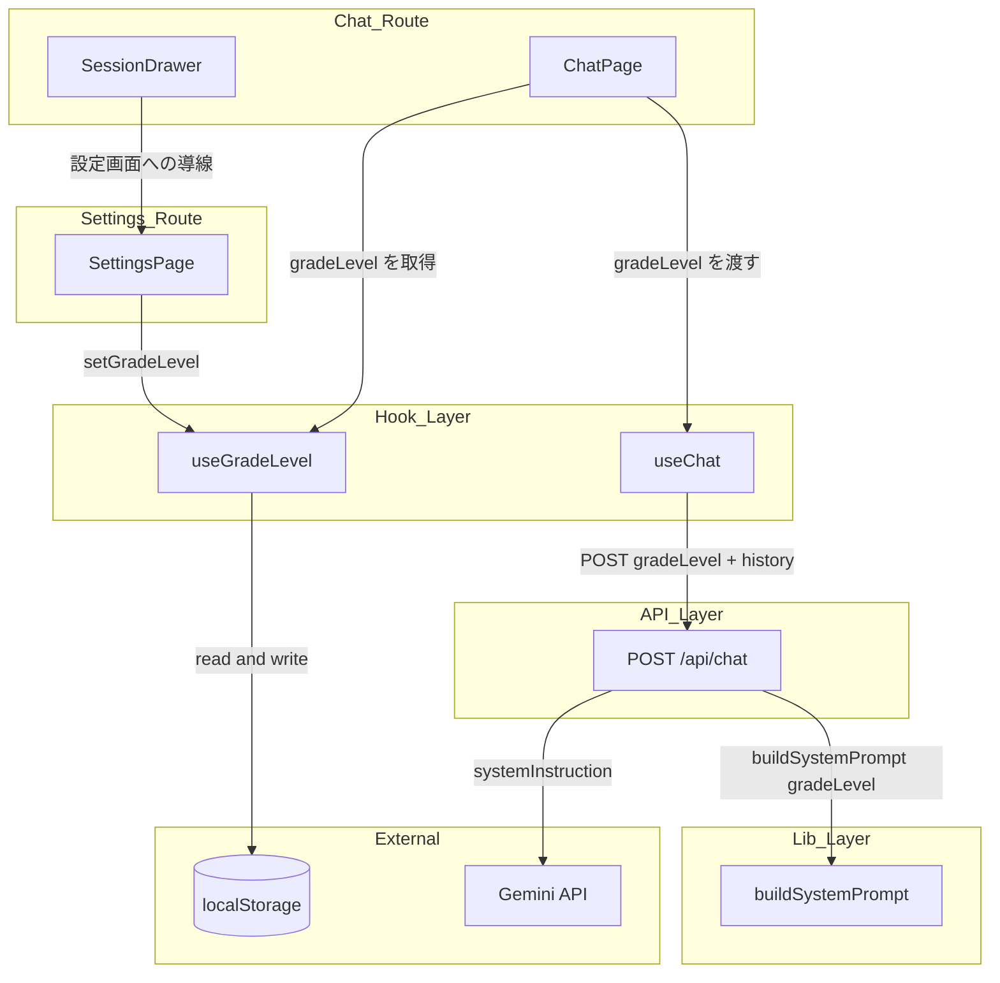
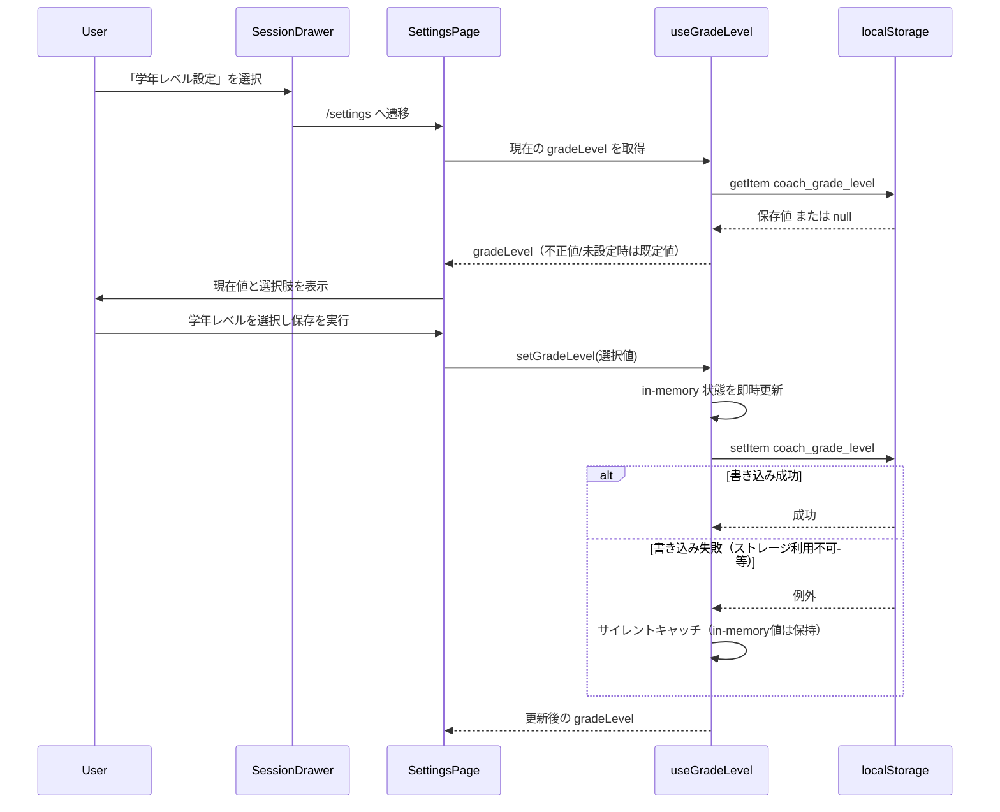
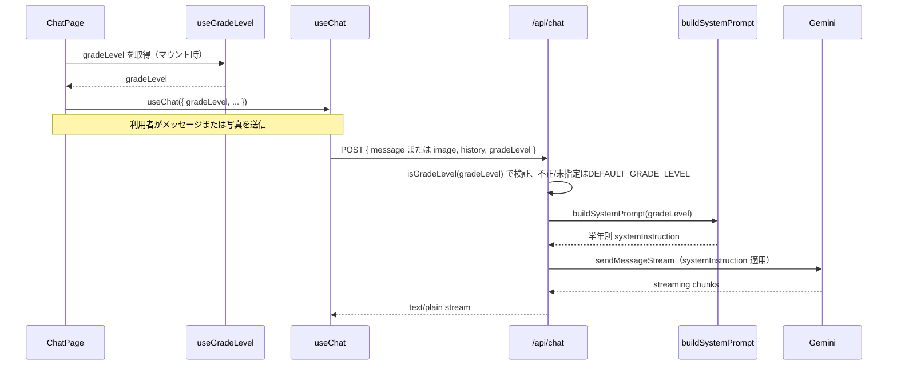

# Design Document: grade-level-coaching

## Overview

学習支援チャットアプリ「my-coach-app」に、利用者が学年レベル（中学生 / 高校生）を設定し、AI コーチがその学年レベルに応じて説明の難易度・語彙を調整する機能を追加する。利用者は専用の `/settings` 画面から学年レベルをいつでも確認・変更でき、チャット画面のドロワーメニューから導線を提供する。

既存の chat-core / session-history スペックを拡張する形で実装する。学年レベルは端末（ブラウザ）単位の localStorage に保存し、既存の `use-session-storage` と同じ SSR 安全パターンを踏襲する。AI コーチングへの反映は、`SYSTEM_PROMPT` の静的定数を `buildSystemPrompt(gradeLevel)` 関数に置き換え、`/api/chat` がリクエストボディで受け取った学年レベルを Gemini の `systemInstruction` に反映することで実現する。新規外部依存は発生しない。

### Goals

- 学年レベル（中学生 / 高校生）を専用設定画面で選択・保存・変更できるようにする
- チャット画面から設定画面への導線を提供する
- AI コーチの説明を学年レベルに応じて調整する（既存のヒント中心コーチング方針は維持）
- 学年レベルの保存に失敗してもチャット機能をブロックしない

### Non-Goals

- 学年レベル以外のプロフィール項目（氏名・学校名など）の追加
- 中学生・高校生以外の学年区分（大学生など）への対応
- アカウント単位でのサーバー側永続化・複数デバイス間での設定同期
- 会話履歴（Message/Session）への学年レベルの記録・復元

---

## Boundary Commitments

### This Spec Owns

- `GradeLevel` 型・デフォルト値・バリデータ（`src/types/grade-level.ts`）
- 学年レベルの localStorage 読み書きフック（`use-grade-level`）
- 学年レベル設定画面（`/settings` ページ）
- チャット画面（ドロワー）から設定画面への導線
- `SYSTEM_PROMPT` 定数から `buildSystemPrompt(gradeLevel)` 関数への置き換え
- `/api/chat` ルートの `gradeLevel` フィールド受け付け・検証・`buildSystemPrompt` への反映
- `useChat` フックの `gradeLevel` 送信対応

### Out of Boundary

- 認証・ルート保護（auth スペックの責務。`/settings` は既存 middleware の matcher により自動的に保護対象となるが、保護ロジック自体は変更しない）
- セッション履歴の永続化・表示ロジック（session-history スペックの責務。`Message`/`Session` 型は変更しない）
- 学年レベルのサーバー側永続化・アカウント単位の同期（将来的に auth スペックがアカウント基盤を持つ場合の拡張候補、本スペックのスコープ外）
- 画像コーチング機能そのもの（image-coaching スペックの責務。`SYSTEM_PROMPT` 内の写真コーチング指示は維持するのみで変更しない）

### Allowed Dependencies

- localStorage（ブラウザネイティブ、新規キー `coach_grade_level`）
- `src/lib/system-prompt.ts`（所有して関数化）
- `src/app/api/chat/route.ts`（所有して拡張）
- `src/hooks/use-chat.ts`（所有して拡張）
- `src/components/session/session-drawer.tsx`（設定画面への導線を追加）
- `src/app/chat/page.tsx`（`use-grade-level` を `useChat` に接続）
- Next.js App Router（`/settings` ルート新設。既存 `middleware.ts` の matcher が自動的に適用される）

### Revalidation Triggers

- `Message` / `Session` 型に学年レベルを含める変更が発生する場合 → session-history スペックとの境界の見直しが必要（本設計では発生しない）
- 学年レベルのサーバー側永続化・アカウント単位の同期を導入する場合 → auth スペックとの契約定義が必要
- `SYSTEM_PROMPT` の構造変更（image-coaching が追記した写真コーチング指示との統合方法変更）→ 両スペックの整合性確認が必要
- `/api/chat` の `ChatRequest` 形式変更 → `useChat` との契約検証が必要

---

## Architecture

### Existing Architecture Analysis

現在の `/chat` ページは `useChat`（送受信）と `useSessionStorage`（会話永続化）を組み合わせ、`/api/chat` が認証済みセッションを前提に Gemini とのストリーミングを仲介する。`SYSTEM_PROMPT` は `src/lib/system-prompt.ts` の静的定数であり、学年を考慮しないハードコードされた指示文（中学生固定）になっている。設定画面やプロフィール管理の仕組みは存在しない。

本機能はこの既存フローを次の 2 点で拡張する:
- **新規のローカル設定領域**: `/settings` ページ + `use-grade-level` フックが、既存の `use-session-storage` と同じ localStorage パターン（SSR 安全な同期初期化、書き込み失敗のサイレントキャッチ）に従い、独立した永続化領域を持つ
- **既存フローへの値の注入**: `useChat` が送信時に `gradeLevel` をリクエストボディに含め、`/api/chat` が `buildSystemPrompt(gradeLevel)` を呼び出して Gemini の `systemInstruction` を切り替える

### Architecture Pattern & Boundary Map



**Key Decisions**:
- 学年レベル用に専用エンドポイントは新設せず、既存 `/api/chat` にフィールドを追加する（認証・ストリーミング基盤の再利用）
- 学年レベルはサーバー側でセッション管理しない。クライアントが `useGradeLevel` で読み取った値を毎リクエストで送信し、サーバーは検証のみ行う（アカウント基盤が存在しないため）
- `/settings` は独立した Next.js ルートとし、既存の `SessionDrawer` からリンクする（ダイアログではなく通常ページ遷移。専用設定画面という要件を素直に満たす最小構成）

### Technology Stack

| Layer | Choice / Version | Role in Feature | Notes |
|-------|------------------|-----------------|-------|
| Frontend | React 19.2.4 / Next.js 16.2.9 (App Router) | `/settings` ページ、ドロワー導線 | 既存スタック、変更なし |
| Storage | localStorage（既存パターン踏襲） | 学年レベルの端末保存 | 新規キー `coach_grade_level` のみ追加 |
| AI Integration | `@google/genai` v2.10.0 | `systemInstruction` に学年別プロンプトを渡す | 既存呼び出し箇所を変更、新規依存なし |

---

## File Structure Plan

### Directory Structure

```
src/
├── types/
│   └── grade-level.ts          # 新規: GradeLevel型、DEFAULT_GRADE_LEVEL、isGradeLevelバリデータ
├── hooks/
│   ├── use-grade-level.ts      # 新規: 学年レベルのlocalStorage読み書きフック
│   └── use-chat.ts             # 変更: gradeLevelオプション追加、POSTボディに含める
├── lib/
│   └── system-prompt.ts        # 変更: SYSTEM_PROMPT定数 → buildSystemPrompt(gradeLevel)関数化
├── app/
│   ├── settings/
│   │   └── page.tsx            # 新規: 学年レベル設定画面
│   ├── chat/
│   │   └── page.tsx            # 変更: useGradeLevelの値をuseChatに接続
│   └── api/
│       └── chat/
│           └── route.ts        # 変更: gradeLevelフィールドの受け付け・検証
└── components/
    └── session/
        └── session-drawer.tsx  # 変更: 設定画面への導線（メニュー項目）を追加
```

### Modified Files

- `src/hooks/use-chat.ts` — `UseChatOptions` に `gradeLevel: GradeLevel` を追加。`sendMessage`/`sendImage` の POST ボディに含める
- `src/lib/system-prompt.ts` — `SYSTEM_PROMPT` 定数を `buildSystemPrompt(gradeLevel: GradeLevel): string` に置き換え
- `src/app/api/chat/route.ts` — `ChatRequest` に `gradeLevel?: string` を追加。`isGradeLevel` で検証し不正値/未指定時は `DEFAULT_GRADE_LEVEL` にフォールバック
- `src/app/chat/page.tsx` — `useGradeLevel()` を呼び出し、`gradeLevel` を `useChat` に渡す
- `src/components/session/session-drawer.tsx` — 「学年レベル設定」メニュー項目を追加し `/settings` へ遷移させる

---

## System Flows

### 学年レベル設定・保存フロー



**Key Decision**: 保存失敗時も `setGradeLevel` は in-memory 状態を先に更新するため、同一セッション内のチャット利用は選択値（または直前まで有効だった値）で継続する（Req 4.1）。永続化失敗はユーザーに追加のエラー表示をしない（既存 `use-session-storage` の書き込み失敗ハンドリングと同じサイレント方針）。

### 学年レベルを反映したチャット送信フロー



**Key Decision**: 学年レベルはサーバー側でセッション化せず、毎リクエストでクライアントから送信する。`ChatPage` は `/settings` からの遷移後に再マウントされるため、直近の保存値が `useGradeLevel` の初期読み込みで反映される（Req 3.3）。

---

## Requirements Traceability

| 要件 | 概要 | コンポーネント | インターフェース | フロー |
|------|------|----------------|------------------|--------|
| 1.1 | 選択・保存操作で端末に保存 | SettingsPage, useGradeLevel | `setGradeLevel(level)` | 設定・保存フロー |
| 1.2 | 未設定時はデフォルト（中学生） | useGradeLevel | `DEFAULT_GRADE_LEVEL` | — |
| 1.3 | 再利用時に前回値を保持 | useGradeLevel | `readGradeLevel()` 初期化 | — |
| 1.4 | 不正値はデフォルト扱い | useGradeLevel, GradeLevel型 | `isGradeLevel(value)` | — |
| 2.1 | チャット画面から設定画面への導線 | SessionDrawer | 「学年レベル設定」メニュー項目 | 設定・保存フロー |
| 2.2 | 現在値と選択肢を表示 | SettingsPage | `gradeLevel` 表示 + 選択UI | 設定・保存フロー |
| 2.3 | 変更後に保存済み値を更新 | SettingsPage, useGradeLevel | `setGradeLevel(level)` | 設定・保存フロー |
| 3.1 | 中学生向け説明 | buildSystemPrompt | `buildSystemPrompt("junior_high")` | チャット送信フロー |
| 3.2 | 高校生向け説明（より高度） | buildSystemPrompt | `buildSystemPrompt("high_school")` | チャット送信フロー |
| 3.3 | 変更後の学年レベルを反映して応答 | ChatPage, useChat, /api/chat | `gradeLevel` の POST 反映 | チャット送信フロー |
| 3.4 | 既存のヒント中心方針を維持 | buildSystemPrompt | 共通指示部分（1〜4, 6〜8行目） | — |
| 4.1 | 保存失敗時もチャット継続 | useGradeLevel | `setGradeLevel` のサイレントキャッチ | 設定・保存フロー |

---

## Components and Interfaces

### Summary Table

| Component | Layer | Intent | Req Coverage | Key Dependencies |
|-----------|-------|--------|--------------|-------------------|
| GradeLevel型/バリデータ | types | 学年レベルの型・既定値・検証を定義 | 1.2, 1.4 | — |
| useGradeLevel | Hook | localStorage 読み書き、既定値/不正値フォールバック | 1.1–1.4, 2.2, 2.3, 4.1 | localStorage (P0), GradeLevel型 (P0) |
| SettingsPage | UI | 学年レベルの表示・選択・保存 | 2.1–2.3 | useGradeLevel (P0) |
| SessionDrawer（変更） | UI | 設定画面への導線を追加 | 2.1 | Next.js Link (P0) |
| ChatPage（変更） | UI | useGradeLevel を useChat に接続 | 3.3 | useGradeLevel (P0), useChat (P0) |
| useChat（変更） | Hook | gradeLevel を送信ボディに含める | 3.3 | /api/chat (P0) |
| buildSystemPrompt | lib | 学年レベル別の systemInstruction を生成 | 3.1, 3.2, 3.4 | GradeLevel型 (P0) |
| /api/chat route（変更） | API | gradeLevel の検証とプロンプト反映 | 3.1–3.4 | buildSystemPrompt (P0), GradeLevel型 (P0) |

---

### types 層

#### GradeLevel 型・バリデータ

| Field | Detail |
|-------|--------|
| Intent | 学年レベルの型・既定値・実行時バリデータを一箇所で定義し、クライアント/サーバー双方から共有する |
| Requirements | 1.2, 1.4 |

**Responsibilities & Constraints**
- 学年レベルは `"junior_high"` \| `"high_school"` の 2 値のみ
- 既定値は `"junior_high"`（Req 1.2、既存 `SYSTEM_PROMPT` の従来挙動と一致させる）
- `isGradeLevel` は不明な入力（`unknown`）を安全に検証する型ガードとして提供する

**Contracts**: Service [x]

##### Service Interface
```typescript
export type GradeLevel = "junior_high" | "high_school";

export const DEFAULT_GRADE_LEVEL: GradeLevel = "junior_high";

export function isGradeLevel(value: unknown): value is GradeLevel;
// Postconditions: value が "junior_high" または "high_school" のときのみ true
```

---

### Hook 層

#### useGradeLevel

| Field | Detail |
|-------|--------|
| Intent | 学年レベルを localStorage から SSR 安全に読み込み、変更を永続化する |
| Requirements | 1.1, 1.2, 1.3, 1.4, 2.2, 2.3, 4.1 |

**Responsibilities & Constraints**
- マウント時に `readGradeLevel()` で同期初期化する（`use-session-storage` の `readInitialSessionData` と同じ SSR 安全パターン）
- 読み込み値が `isGradeLevel` を満たさない場合は `DEFAULT_GRADE_LEVEL` を返す（Req 1.2, 1.4）
- `setGradeLevel` は in-memory 状態を先に更新してから localStorage へ書き込む。書き込み例外はサイレントキャッチする（Req 4.1）

**Dependencies**
- External: localStorage（ブラウザネイティブ, P0）
- Inbound: GradeLevel 型・`isGradeLevel`（P0）

**Contracts**: Service [x] / State [x]

##### Service Interface
```typescript
export interface UseGradeLevelReturn {
  gradeLevel: GradeLevel;
  setGradeLevel: (level: GradeLevel) => void;
}

export function useGradeLevel(): UseGradeLevelReturn;
// Preconditions: なし
// Postconditions: gradeLevel は常に isGradeLevel を満たす値
// Invariants: setGradeLevel 呼び出し後、永続化の成否に関わらず gradeLevel は選択値に更新される
```

**Implementation Notes**
- Integration: localStorage キーは `coach_grade_level`。`use-session-storage.ts` の `readSessions`/`writeSessions` と同型の try/catch パターンを踏襲する
- Risks: プライベートブラウジング等で `localStorage.getItem` 自体が例外を投げる環境 → try/catch で `DEFAULT_GRADE_LEVEL` にフォールバックする

---

### UI 層

#### SettingsPage（新規）

| Field | Detail |
|-------|--------|
| Intent | 学年レベルの現在値表示・選択・保存操作を提供する専用画面 |
| Requirements | 2.1, 2.2, 2.3 |

**Contracts**: State [x]

##### State Management
```typescript
// 内部状態: 保存前の選択値（保存済み値とは独立して保持する）
type SettingsPageState = {
  selected: GradeLevel; // useGradeLevel().gradeLevel で初期化
};
```

**Implementation Notes**
- Integration: `useGradeLevel()` から現在の `gradeLevel` を取得して初期表示・選択肢の初期値に使う（Req 2.2）。保存ボタン押下時のみ `setGradeLevel(selected)` を呼び出す（Req 2.3、選択と保存を分離し誤操作を防ぐ）
- Navigation: チャット画面へ戻る導線（`next/link` で `/chat` へ）を設ける
- Validation: 選択肢は `"junior_high"`（中学生）と `"high_school"`（高校生）の 2 択のみ表示する

#### SessionDrawer（変更）

| Field | Detail |
|-------|--------|
| Intent | 既存のドロワーメニューに学年レベル設定画面への導線を追加する |
| Requirements | 2.1 |

**Contracts**: —（表示のみの変更、新規契約なし）

**Implementation Notes**
- Integration: 「新しい会話」ボタンと「過去の会話」一覧の間、または「ログアウト」の直前に `next/link` の `/settings` へのメニュー項目「学年レベル設定」を追加する。既存の他メニュー項目と同じスタイル（`px-4 py-3 hover:bg-gray-100` 等）を踏襲する

#### ChatPage（変更）

| Field | Detail |
|-------|--------|
| Intent | `useGradeLevel` の値を取得し `useChat` に橋渡しする |
| Requirements | 3.3 |

**Contracts**: —（配線のみ、新規契約なし）

**Implementation Notes**
- Integration: `const { gradeLevel } = useGradeLevel();` を追加し、`useChat({ gradeLevel, ... })` に渡す

---

### Hook 層（続き）

#### useChat（変更）

| Field | Detail |
|-------|--------|
| Intent | `gradeLevel` を送信リクエストボディに含める |
| Requirements | 3.3 |

**Contracts**: Service [x]

##### Service Interface
```typescript
export interface UseChatOptions {
  initialMessages?: Message[];
  gradeLevel: GradeLevel; // 追加: 呼び出し側（ChatPage）が useGradeLevel から取得して渡す
  onStreamComplete?: (messages: Message[]) => void;
}
```

**Implementation Notes**
- Integration: `sendMessage`/`sendImage` それぞれの `fetch` 呼び出しの `body` に `gradeLevel: options.gradeLevel` を追加する（既存の `message`/`image`/`history` に加える）

---

### lib 層

#### buildSystemPrompt（変更）

| Field | Detail |
|-------|--------|
| Intent | 学年レベルに応じた `systemInstruction` 文字列を生成する |
| Requirements | 3.1, 3.2, 3.4 |

**Contracts**: Service [x]

##### Service Interface
```typescript
export function buildSystemPrompt(gradeLevel: GradeLevel): string;
// Preconditions: gradeLevel は isGradeLevel を満たす値（呼び出し側で検証済み）
// Postconditions: 学年レベルに応じた語彙レベル指示を含む文字列を返す。
//   ヒント中心コーチング方針（答えを直接教えない等）はどちらの学年レベルでも共通して含まれる（Req 3.4）
```

**Implementation Notes**
- Integration: 既存の `SYSTEM_PROMPT` 定数（8 行の指示）のうち、語彙レベルに関する 1 行のみ `gradeLevel` で分岐させる。答えを直接教えない・ヒントで導く・写真分析といった既存の指示（1〜4, 6〜8 行目）はそのまま両学年で共通利用する（Req 3.4）
- 中学生（`"junior_high"`）: 「中学校で学習する語彙・既習範囲を前提とし、中学生にわかりやすい言葉を使ってください」
- 高校生（`"high_school"`）: 「高校で学習する語彙・既習範囲を前提とし、中学生向けよりも高度な言葉づかいで説明してください」

---

### API 層

#### /api/chat route（変更）

| Field | Detail |
|-------|--------|
| Intent | `gradeLevel` を受け付けて検証し、`buildSystemPrompt` に反映する |
| Requirements | 3.1, 3.2, 3.3, 3.4 |

**Contracts**: API [x]

##### API Contract

| Method | Endpoint | Request | Response | Errors |
|--------|----------|---------|----------|--------|
| POST | /api/chat | `ChatRequest`（`gradeLevel?` 追加） | `text/plain` stream | 401, 429, 500（変更なし） |

```typescript
type ChatRequest = {
  message?: string;
  image?: { data: string; mimeType: string };
  history: Message[];
  gradeLevel?: string; // 追加: 未指定・不正値時は DEFAULT_GRADE_LEVEL にフォールバック
};

// 検証・フォールバック
const gradeLevel: GradeLevel = isGradeLevel(body.gradeLevel)
  ? body.gradeLevel
  : DEFAULT_GRADE_LEVEL;

// Gemini 呼び出し
const chat = ai.chats.create({
  model: "gemini-3.1-flash-lite",
  history: geminiHistory,
  config: { systemInstruction: buildSystemPrompt(gradeLevel) },
});
```

**Implementation Notes**
- Integration: 既存の認証チェック（401）・レート制限ハンドリング（429）・ストリーミングループは変更しない
- Validation: `gradeLevel` が未指定または `isGradeLevel` を満たさない場合はエラーを返さず `DEFAULT_GRADE_LEVEL` にフォールバックする（クライアント側の不整合でチャット機能自体を止めない方針、Req 4.1 と整合）

---

## Data Models

### GradeLevel（新規）

```typescript
// src/types/grade-level.ts
export type GradeLevel = "junior_high" | "high_school";
export const DEFAULT_GRADE_LEVEL: GradeLevel = "junior_high";
export function isGradeLevel(value: unknown): value is GradeLevel {
  return value === "junior_high" || value === "high_school";
}
```

**永続化フォーマット（localStorage）**:
- キー: `coach_grade_level`
- 値: `GradeLevel` 文字列をそのまま格納（JSON エンコード不要、プリミティブ文字列）
- `Message` / `Session` 型（session-history スペック所有）は変更しない。学年レベルは会話データとは独立した設定値として扱う

---

## Error Handling

### Error Strategy

学年レベル関連のエラーは既存のチャットエラーハンドリングとは独立させ、いずれも「サイレントフォールバック」方針を取る。ユーザー操作をブロックするエラー表示は行わない。

### Error Categories and Responses

| カテゴリ | トリガー | 対応 | Req |
|---------|---------|------|-----|
| 未設定 | `localStorage.getItem` が null を返す | `DEFAULT_GRADE_LEVEL` を使用 | 1.2 |
| 不正な保存値 | 保存値が `isGradeLevel` を満たさない | `DEFAULT_GRADE_LEVEL` を使用 | 1.4 |
| 保存失敗 | `localStorage.setItem` が例外をスロー（容量超過・プライベートモード等） | サイレントキャッチ。in-memory 状態は選択値のまま維持しチャット機能を継続 | 4.1 |
| サーバー側不正値 | `/api/chat` が受け取った `gradeLevel` が未指定または不正 | `DEFAULT_GRADE_LEVEL` にフォールバックしてリクエストを継続処理（エラーを返さない） | 3.1–3.4, 4.1 |

---

## Testing Strategy

### Unit Tests

- `isGradeLevel`: `"junior_high"`/`"high_school"` で true、それ以外の文字列・`undefined`・`null` で false を返すことを検証（Req 1.4）
- `useGradeLevel`: 未設定時に `DEFAULT_GRADE_LEVEL` を返すこと（Req 1.2）。保存済みの正常値を読み込むこと（Req 1.3）。不正値保存時に既定値にフォールバックすること（Req 1.4）。`setGradeLevel` 呼び出し後に `gradeLevel` が更新されること、`localStorage.setItem` が例外をスローしても `gradeLevel` の状態更新自体は成功すること（Req 4.1）
- `buildSystemPrompt`: `"junior_high"` と `"high_school"` で異なる語彙レベル指示を含む文字列を返すこと（Req 3.1, 3.2）。両学年でヒント中心コーチング指示（答えを直接教えない等）が共通して含まれること（Req 3.4）

### Integration Tests

- `SettingsPage`: マウント時に現在の `gradeLevel` が選択済み表示されること（Req 2.2）。選択を変更して保存操作を行うと `useGradeLevel` 側の値が更新されること（Req 2.3）
- `useChat`: `fetch` をモックし、`sendMessage`/`sendImage` 呼び出し時の POST ボディに `gradeLevel` が含まれることを検証（Req 3.3）
- `/api/chat` route: `gradeLevel: "high_school"` を含むリクエストで `buildSystemPrompt` が高校生向け文字列を生成すること。`gradeLevel` 未指定・不正値のリクエストでも 400 を返さず `DEFAULT_GRADE_LEVEL` で処理を継続すること（Req 3.1–3.4, 4.1）

### E2E / UI Tests（手動）

- ドロワーの「学年レベル設定」から `/settings` へ遷移し、学年レベルを変更して保存 → チャット画面に戻りメッセージを送信 → リクエストボディに変更後の学年レベルが反映されていることを確認（Req 2.1–2.3, 3.3 ゴールデンパス）
- 学年レベル未設定の初回利用時、チャットが中学生向けの説明で応答すること（Req 1.2, 3.1）
- localStorage を利用不可にした状態（例: ブラウザ設定でブロック）でも学年レベル設定操作後にチャット送信が失敗しないこと（Req 4.1）
