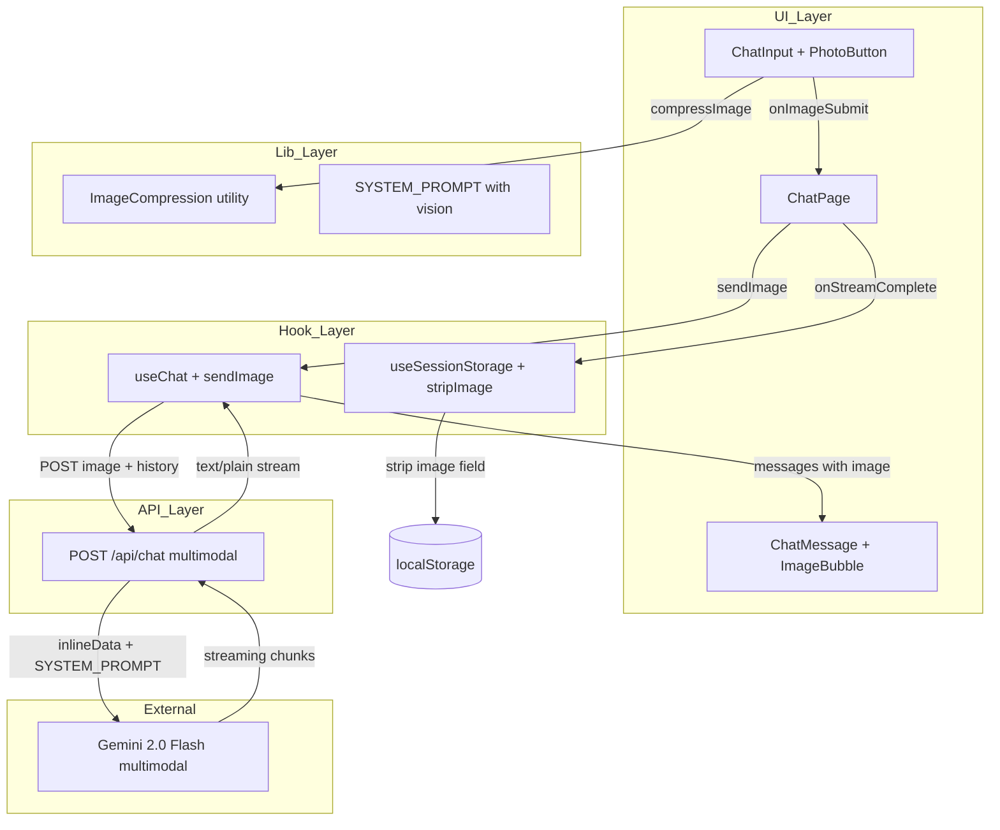
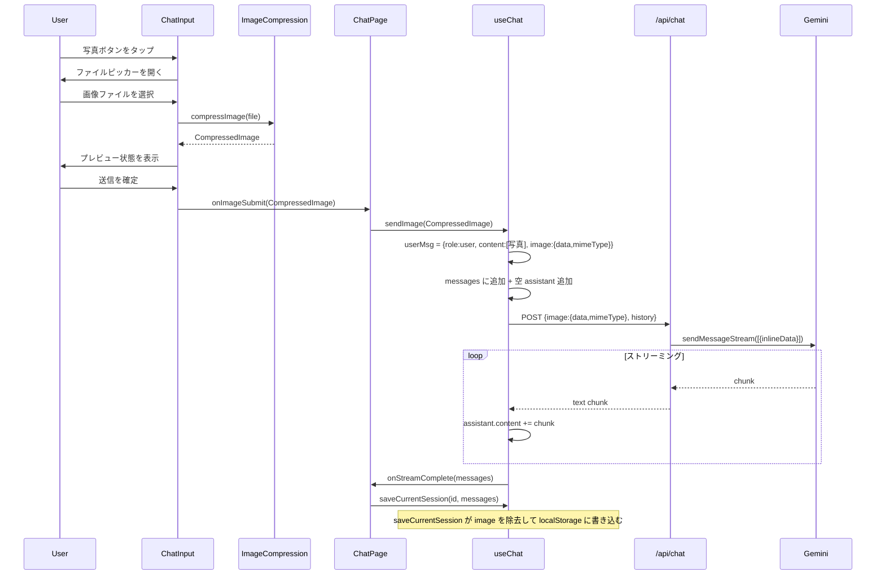

# Design Document: image-coaching

## Overview

中学生向け学習支援チャットアプリ「my-coach-app」に写真によるマルチモーダルコーチング機能を追加する。ユーザーは既存の `/chat` ページで写真ボタンをタップし、カメラ撮影またはフォトライブラリから写真を選択して AI コーチに送ることができる。AI は写真内の問題を分析し、答えを直接教えず、ヒントと問いかけでコーチングする。写真送信後も同一会話でテキスト追加質問が可能。

既存の chat-core スペックを拡張する形で実装する。`@google/genai` v2.10.0 の `inlineData` 部品でネイティブな画像入力が可能であり、新規依存の追加は不要。画像圧縮は Canvas API（プラットフォームネイティブ）で行い、localStorage への画像バイナリ保存は行わない（ADR-002 の `content: string` 不変条件を維持）。

### Goals

- 写真ボタンからカメラ/アルバム選択 → 送信 → AI コーチング返答のフローを完成させる
- 写真送信後のテキスト追加質問でマルチターン継続を実現する
- ADR-002 不変条件（localStorage メッセージは `content: string`）を維持する

### Non-Goals

- localStorage への画像バイナリ永続化（セッション復元時は `[写真]` プレースホルダーを表示）
- 複数画像の同時送信
- 動画・音声入力、画像アノテーション・トリミング
- 専用フォトコーチページ（`/photo-coach`）の新設

---

## Boundary Commitments

### This Spec Owns

- `Message` 型への `image?: MessageImage` フィールドの追加
- `ImageCompression` ユーティリティ（Canvas API による圧縮ロジック）
- `ChatInput` への写真ボタン・プレビュー状態・`onImageSubmit` コールバックの追加
- `ChatMessage` への画像バブルレンダリング分岐の追加
- `useChat` フックへの `sendImage` 関数の追加
- `/api/chat` ルートのマルチモーダル（`inlineData`）対応拡張
- `use-session-storage` の `saveCurrentSession` における `image` フィールド剥ぎ取りロジック
- `SYSTEM_PROMPT` への画像コーチング指示の追記

### Out of Boundary

- セッション履歴の表示ロジック・ドロワーUI（session-history スペックの責務）
- 認証・ルート保護（auth スペックの責務）
- IndexedDB / バックエンドへの画像永続保存（本スペックのスコープ外、将来フェーズ）
- 画像付きメッセージを含む過去セッションの読み取り専用表示（プレースホルダー表示で対応済み）

### Allowed Dependencies

- `@google/genai` v2.10.0（`inlineData` パーツ、`Part` 型）
- Canvas API / `createImageBitmap`（プラットフォームネイティブ）
- `src/types/message.ts`（所有して拡張）
- `src/types/session.ts`（参照のみ。Session.messages は Message[] 型）
- `src/lib/system-prompt.ts`（所有して拡張）
- NextAuth セッション（`auth()` 呼び出し、変更なし）

### Revalidation Triggers

- `Message` 型の変更（`image` フィールドの追加/変更/削除）→ session-history スペックが影響を受ける
- `saveCurrentSession` の localStorage シリアライズ仕様変更 → ADR-002 の見直し要
- `/api/chat` のリクエスト形式変更 → `useChat.sendImage` との契約検証が必要

---

## Architecture

### Existing Architecture Analysis

現在の `/chat` ページは `useChat`（テキスト送受信）と `useSessionStorage`（永続化）を組み合わせ、`ChatInput`（入力UI）と `ChatMessage`（表示UI）が会話フローを構成する。`/api/chat` は POST リクエストを受け、Gemini chat セッションを作成してストリーミング返答を返す。

画像コーチング機能はこの既存フローを最小限の変更で拡張する：
- 入力側に画像パスを追加する（`ChatInput` + `useChat.sendImage` + API ルート拡張）
- 表示側に画像バブルを追加する（`ChatMessage` の分岐）
- 永続化側で `image` を剥ぎ取る（`use-session-storage` の書き込み前処理）

### Architecture Pattern & Boundary Map



**Key Decisions**:
- 専用エンドポイントを新設せず `/api/chat` を拡張（認証・ストリーミング基盤の再利用）
- `ChatInput` 内でプレビュー状態を管理（外部モーダルコンポーネント不要）
- `ImageCompression` を `lib/` 層に分離（UI と圧縮ロジックの関心分離、テスト容易性）

### Technology Stack

| Layer | Choice / Version | Role | Notes |
|-------|-----------------|------|-------|
| Frontend | React 19.2.4 / Next.js 16.2.9 | 写真ボタン・プレビュー UI | 変更なし |
| Image Processing | Canvas API（ブラウザネイティブ） | 画像リサイズ・JPEG 圧縮 | 外部ライブラリ追加なし |
| File Input | `<input type="file" accept="image/*">` | カメラ/アルバム選択 | モバイル標準挙動 |
| AI Integration | `@google/genai` v2.10.0 | Gemini multimodal 呼び出し | `inlineData` パーツを使用 |
| Storage | localStorage（既存） | テキストメッセージのみ永続化 | 画像バイナリは保存しない |

---

## File Structure Plan

### Directory Structure

```
src/
├── lib/
│   ├── image-compression.ts   # 新規: Canvas API 圧縮ユーティリティ
│   └── system-prompt.ts       # 変更: 画像コーチング指示を追記
├── types/
│   └── message.ts             # 変更: MessageImage 型追加、image フィールド追加
├── components/
│   └── chat/
│       ├── chat-input.tsx     # 変更: 写真ボタン・プレビュー状態・onImageSubmit prop
│       └── chat-message.tsx   # 変更: image フィールドでの画像バブル分岐
├── hooks/
│   ├── use-chat.ts            # 変更: sendImage 関数を追加
│   └── use-session-storage.ts # 変更: saveCurrentSession で image を剥ぎ取り
└── app/
    └── api/
        └── chat/
            └── route.ts       # 変更: 画像リクエスト受け付け・multimodal Gemini 呼び出し
```

### Modified Files

- `src/types/message.ts` — `MessageImage` 型と `Message.image?` フィールドを追加
- `src/components/chat/chat-input.tsx` — `onImageSubmit` prop・写真ボタン・プレビュー状態を追加
- `src/components/chat/chat-message.tsx` — `message.image` 存在時に `` バブルをレンダリング
- `src/hooks/use-chat.ts` — `sendImage(image: CompressedImage): Promise<void>` を追加
- `src/hooks/use-session-storage.ts` — `saveCurrentSession` で保存前に `image` フィールドを除去
- `src/app/api/chat/route.ts` — リクエストボディに `image?` を追加、Gemini マルチモーダル呼び出しに対応
- `src/lib/system-prompt.ts` — 画像コーチング指示を `SYSTEM_PROMPT` に追記

---

## System Flows

### 写真送信フロー



**Key Decision**: `saveCurrentSession` はストレージ層の責務として `image` フィールドを剥ぎ取る。呼び出し側（`ChatPage`）は意識不要。

### セッション復元フロー（画像メッセージ含む）

ページリフレッシュ時、localStorage から `{role:"user", content:"[写真]"}` として復元される（`image` フィールドは保存されていない）。`ChatMessage` は `message.image` が `undefined` のため、テキストバブルで `[写真]` を表示する（Req 5.1）。

---

## Requirements Traceability

| 要件 | 概要 | コンポーネント | インターフェース | フロー |
|------|------|----------------|------------------|--------|
| 1.1 | 写真ボタンを表示 | ChatInput | `ChatInputProps.onImageSubmit` | — |
| 1.2 | ダイアログを開く | ChatInput | `<input type="file">` | — |
| 1.3 | プレビュー表示 | ChatInput | `pendingImage` 状態 | 写真送信フロー |
| 1.4 | キャンセル | ChatInput | `pendingImage = null` | — |
| 1.5 | ストリーミング中無効化 | ChatInput | `disabled` prop | — |
| 1.6 | 非画像ファイル拒否 | ChatInput | `accept="image/*"` + バリデーション | — |
| 2.1 | 画像バブル表示（右寄せ） | ChatMessage | `message.image` 分岐 | — |
| 2.2 | 最大幅 80% | ChatMessage | 既存 Tailwind クラス流用 | — |
| 3.1 | AI ストリーミング開始 | useChat + /api/chat | `sendImage` → POST | 写真送信フロー |
| 3.2 | ヒント形式コーチング | SYSTEM_PROMPT | 画像コーチング指示追記 | — |
| 3.3 | リアルタイムストリーミング表示 | useChat | 既存ストリーム読み取り流用 | 写真送信フロー |
| 3.4 | Markdown レンダリング | ChatMessage | 既存 react-markdown 流用 | — |
| 4.1 | 返答完了後テキスト再有効化 | useChat | `isStreaming = false` 既存動作 | — |
| 4.2 | 同一会話でのテキスト継続 | useChat + /api/chat | `history` に画像メッセージ含む | — |
| 5.1 | `[写真]` プレースホルダー | ChatMessage | `image === undefined` 時の text 描画 | セッション復元フロー |
| 5.2 | テキストメッセージ正常復元 | use-session-storage | `content` を保持（既存動作） | — |
| 6.1 | API エラー表示 | useChat | 既存エラーハンドリング流用 | — |
| 6.2 | 非画像ファイル拒否 | ChatInput | MIME バリデーション | — |
| 6.3 | プレビュー読み込みエラー | ChatInput | `` フォールバック | — |

---

## Components and Interfaces

### Summary Table

| Component | Layer | Intent | Req Coverage | Key Dependencies |
|-----------|-------|--------|--------------|-----------------|
| ImageCompression | lib | Canvas API による画像圧縮 | 1.2, 1.3 | Canvas API (P0) |
| ChatInput | UI | 写真ボタン・プレビュー・送信 | 1.1–1.6 | ImageCompression (P0) |
| ChatMessage | UI | 画像/テキストバブル表示 | 2.1, 2.2, 5.1 | Message 型 (P0) |
| useChat | Hook | sendImage + ストリーミング | 3.1, 3.3, 4.1, 4.2, 6.1 | /api/chat (P0) |
| /api/chat route | API | マルチモーダル Gemini 呼び出し | 3.1, 3.2 | @google/genai (P0) |
| use-session-storage | Hook | image 剥ぎ取り永続化 | 5.1, 5.2 | localStorage (P0) |
| SYSTEM_PROMPT | lib | 画像コーチング指示 | 3.2 | — |

---

### lib 層

#### ImageCompression

| Field | Detail |
|-------|--------|
| Intent | ファイルを受け取り、最大 1024px / JPEG 0.7 に圧縮して base64 文字列を返す |
| Requirements | 1.2, 1.3 |

**Responsibilities & Constraints**
- `compressImage(file: File): Promise<CompressedImage>` を公開する
- 最大辺が 1024px を超える場合にアスペクト比を維持してリサイズする
- 出力フォーマットは JPEG（`image/jpeg`）、品質 0.7
- base64 文字列はデータ URL プレフィックスなし（`data:image/jpeg;base64,` は含まない）
- 入力 MIME タイプが `image/*` 以外の場合はエラーをスローする

**Dependencies**
- External: `createImageBitmap`, `HTMLCanvasElement.toBlob`（ブラウザネイティブ、P0）

**Contracts**: Service [x]

##### Service Interface
```typescript
export type CompressedImage = {
  data: string;    // base64（プレフィックスなし）
  mimeType: "image/jpeg";
};

export async function compressImage(file: File): Promise<CompressedImage>;
// Preconditions: file.type が "image/*" に一致すること
// Postconditions: data は JPEG base64 文字列、最大辺 1024px 以下
// Throws: Error("サポートされていないファイル形式です") — MIME が image/* 以外
```

**Implementation Notes**
- Integration: `createImageBitmap(file)` → canvas に `drawImage` → `canvas.toBlob("image/jpeg", 0.7)` → `FileReader.readAsDataURL` → base64 部分を切り出す
- Risks: iOS Safari 15 未満では `createImageBitmap` 非サポート。必要なら `` + `onload` フォールバックに切り替える。

---

### UI 層

#### ChatInput（変更）

| Field | Detail |
|-------|--------|
| Intent | テキスト入力に加え、写真ボタン・プレビュー状態・画像送信コールバックを追加する |
| Requirements | 1.1, 1.2, 1.3, 1.4, 1.5, 1.6, 6.2, 6.3 |

**Contracts**: State [x]

##### Props Interface
```typescript
interface ChatInputProps {
  onSubmit: (text: string) => void;
  onImageSubmit: (image: CompressedImage) => void; // 追加
  disabled: boolean;
}
```

##### State Management
```typescript
// 内部状態
type ChatInputState =
  | { mode: "text" }                        // 通常入力モード
  | { mode: "preview"; image: CompressedImage }; // 写真プレビューモード
```

- `mode === "text"`: 既存 textarea + 送信ボタン + 写真ボタンを表示
- `mode === "preview"`: 圧縮済み画像のサムネイル + キャンセルボタン + 送信ボタンを表示（textarea は非表示）
- `disabled === true` のとき: 写真ボタン・送信ボタン両方を disabled にする（1.5）

**Implementation Notes**
- Integration: 写真ボタンのクリックで `<input type="file" accept="image/*">` を ref 経由でトリガー。ファイル選択後 `compressImage` を呼び出し `mode = "preview"` に遷移。
- Validation: `file.type.startsWith("image/")` で MIME バリデーション。非画像時はエラーメッセージを表示して mode 変更しない（1.6）。
- Risks: `compressImage` の Promise 中に別ファイルが選択される競合。`input.value = ""` でリセットして防止。

#### ChatMessage（変更）

| Field | Detail |
|-------|--------|
| Intent | `message.image` の有無で画像バブル / テキストバブルを切り替える |
| Requirements | 2.1, 2.2, 5.1 |

**Contracts**: State [x]

**Implementation Notes**
- Integration: `message.image` が存在する場合、`` を右寄せバブル内でレンダリング（2.1, 2.2）。`onError` で代替テキストを表示（6.3）。
- `message.image === undefined` かつ `message.content === "[写真]"` のとき: テキストバブルで `[写真]` を表示（5.1、localStorage 復元パス）。

---

### Hook 層

#### useChat（変更）

| Field | Detail |
|-------|--------|
| Intent | `sendImage` を追加し、画像メッセージのストリーミング送受信を実現する |
| Requirements | 3.1, 3.3, 4.1, 4.2, 6.1 |

**Contracts**: Service [x]

##### Service Interface
```typescript
export interface UseChatReturn {
  messages: Message[];
  isStreaming: boolean;
  error: string | null;
  sendMessage: (text: string) => Promise<void>;  // 既存（変更なし）
  sendImage: (image: CompressedImage) => Promise<void>;  // 追加
  clearMessages: () => void;
}
```

**sendImage の動作**:
1. `{role: "user", content: "[写真]", image: {data, mimeType}}` をメッセージに追加
2. `historySnapshot` を取得（画像 userMsg 追加前の messages）
3. 空の assistant メッセージを追加、`isStreaming = true`
4. `POST /api/chat` with `{image: {data, mimeType}, history: historySnapshot}`
5. ストリーミング受信ループ（`sendMessage` と同一処理）
6. 完了後 `isStreaming = false`、エラーなし完了なら `onStreamComplete` を呼ぶ

**Implementation Notes**
- Integration: 既存の `sendMessage` と同一のストリーミング読み取りループを `sendImage` 内で再利用する。共通のヘルパー関数として抽出してよい。
- Validation: `image.data` が空文字の場合は送信しない（圧縮失敗フォールバック）。

#### use-session-storage（変更）

| Field | Detail |
|-------|--------|
| Intent | `saveCurrentSession` で `image` フィールドを除去してから localStorage に書き込む |
| Requirements | 5.1, 5.2 |

**Contracts**: State [x]

##### State Management
```typescript
// saveCurrentSession 内部での変換（永続化フォーマット）
type PersistedMessage = {
  role: "user" | "assistant";
  content: string;
  // image フィールドは除去して保存しない
};
```

`saveCurrentSession(sessionId, messages)` の変更箇所:
```typescript
const persistedMessages = messages.map(({ role, content }) => ({ role, content }));
// writeSessions に persistedMessages を渡す（image を除く）
```

**Implementation Notes**
- ADR-002 の不変条件「localStorage 上のすべてのメッセージは `content: string` を持つ完結したエントリ」を維持する。
- `archiveCurrentSession` も同様に `image` を除去する。

---

### API 層

#### /api/chat route（変更）

| Field | Detail |
|-------|--------|
| Intent | オプショナルな `image` フィールドを受け付け、Gemini multimodal 呼び出しに対応する |
| Requirements | 3.1, 3.2, 6.1 |

**Contracts**: API [x]

##### API Contract

| Method | Endpoint | Request | Response | Errors |
|--------|----------|---------|----------|--------|
| POST | /api/chat | `ChatRequest` | `text/plain` stream | 401, 429, 500 |

```typescript
type ChatRequest = {
  message?: string;                            // テキストメッセージ（image なし時）
  image?: { data: string; mimeType: string };  // 画像データ（message なし時）
  history: Message[];
};
// バリデーション: message と image のどちらか一方が必須
```

**Gemini 呼び出し変換**:
```typescript
// 履歴変換（既存拡張）
const geminiHistory = history.map((m) => ({
  role: m.role === "assistant" ? "model" : "user",
  parts: m.image
    ? [{ inlineData: { data: m.image.data, mimeType: m.image.mimeType } }]
    : [{ text: m.content }],
}));

// 新規メッセージの Parts 構築
const parts = image
  ? [{ inlineData: { data: image.data, mimeType: image.mimeType } }]
  : undefined;

// stream 送信
const stream = await chat.sendMessageStream(parts ?? message!);
```

**Implementation Notes**
- Integration: 既存の認証チェック・ストリーミングループは変更なし。
- Validation: `message` と `image` の両方が undefined の場合は 400 を返す。

---

## Data Models

### Message 型拡張

```typescript
// src/types/message.ts

export type MessageImage = {
  data: string;     // base64（プレフィックスなし）
  mimeType: string; // "image/jpeg"
};

export type Message = {
  role: "user" | "assistant";
  content: string;        // テキスト内容、または画像メッセージでは "[写真]"
  image?: MessageImage;   // メモリ上のみ（localStorage には保存しない）
};
```

**Invariant（ADR-002 維持）**:
- localStorage に書き込まれる Message は `{role, content}` のみ（`image` は常に除去）
- `image` フィールドは同一セッションの in-memory state にのみ存在する
- セッション復元後: `image === undefined`、`content === "[写真]"` でプレースホルダー表示

### PersistedMessage（localStorage フォーマット）

既存の Session 型に変更はない。`Session.messages` の各要素は `{role: string, content: string}` のみ保存される。

---

## Error Handling

### Error Strategy

画像コーチングのエラーは既存のテキストエラーと同一ハンドリングパターンに従う。新規エラーカテゴリを最小限に留める。

### Error Categories

| カテゴリ | トリガー | 対応 | Req |
|---------|---------|------|-----|
| 非画像ファイル | MIME 型が `image/*` 以外 | ChatInput がエラー表示、送信しない | 6.2 |
| 圧縮エラー | `compressImage` スロー | ChatInput がエラー表示、プレビュー遷移しない | 6.3 間接 |
| プレビュー表示エラー | `` | 代替テキスト表示 | 6.3 |
| API エラー（429/401/500） | `/api/chat` 非 OK レスポンス | `useChat` が `error` state を設定（既存フロー） | 6.1 |
| ネットワークエラー | `fetch` スロー | `useChat` が汎用エラーメッセージ表示（既存フロー） | 6.1 |

---

## Testing Strategy

### Unit Tests

- `compressImage`: 画像ファイルを入力し、`data` が base64 文字列、`mimeType === "image/jpeg"` であることを検証。非画像ファイル入力時のエラースローを検証。
- `saveCurrentSession`（useSessionStorage）: `image` フィールドを含む messages を渡した場合、localStorage に書き込まれた JSON に `image` が含まれないことを検証（Req 5.1）。
- `ChatInput`: 写真ボタンのクリックで `<input type="file">` がトリガーされること。ファイル選択後にプレビューが表示されること。キャンセルで通常入力状態に戻ること。`disabled=true` 時に写真ボタンが無効化されること（Req 1.1–1.5）。
- `ChatMessage`: `message.image` 存在時に `` を描画することを検証。`image === undefined` 時にテキストを描画することを検証（Req 2.1, 5.1）。

### Integration Tests

- `useChat.sendImage`: `fetch` をモックし、`sendImage` 呼び出し後に messages に `{role:"user", image:{...}}` が追加されること、ストリーミング完了後に `onStreamComplete` が呼ばれることを検証（Req 3.1, 3.3, 4.1）。
- `/api/chat` route（画像リクエスト）: `@google/genai` をモックし、`image` を含むリクエストで `inlineData` パーツが Gemini に渡されることを検証（Req 3.1）。`message` と `image` 両方なしで 400 を返すことを検証。

### E2E / UI Tests（手動）

- 写真選択 → プレビュー確認 → 送信 → AI コーチング返答のストリーミング表示（Req 1〜3 ゴールデンパス）
- 写真送信後にテキストで追加質問 → AI が返答（Req 4）
- ページリフレッシュ後、画像メッセージが `[写真]` として表示される（Req 5.1）
- 非画像ファイル選択時のエラー表示（Req 6.2）

---

## Security Considerations

- `accept="image/*"` でファイル型の第一防衛線（クライアント）。サーバー側では `image` フィールドの `mimeType` が `image/` で始まることを検証する。
- base64 画像データは認証済みルート（`auth()` 確認済み）のみが受け付ける。
- 圧縮後サイズを ~200KB 以下に抑え、大容量ペイロードによるサービス影響を防ぐ。

## Performance & Scalability

- 圧縮処理目標: 一般的なスマートフォンで 500ms 以内（ユーザー体感上許容範囲）
- 圧縮後サイズ目標: ≤200KB（Vercel 4.5MB 制限の 5% 未満）
- Gemini 無料枠: 既存の 429 レート制限ハンドリングが画像リクエストにも適用される
