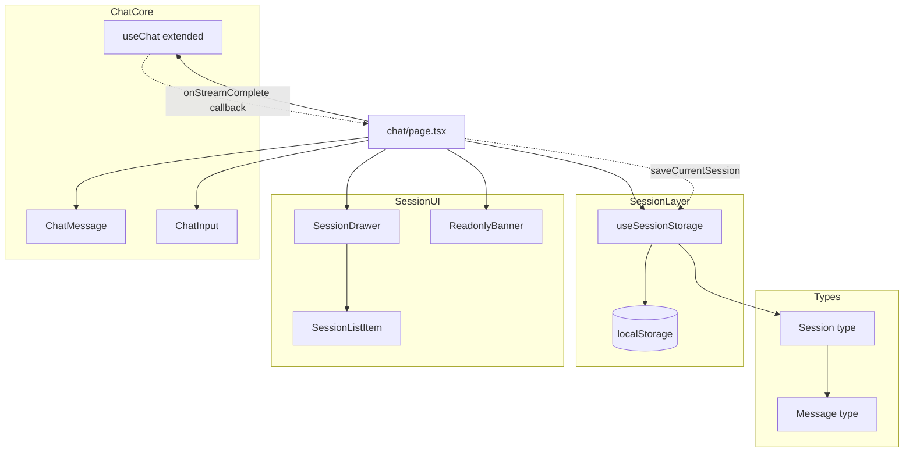
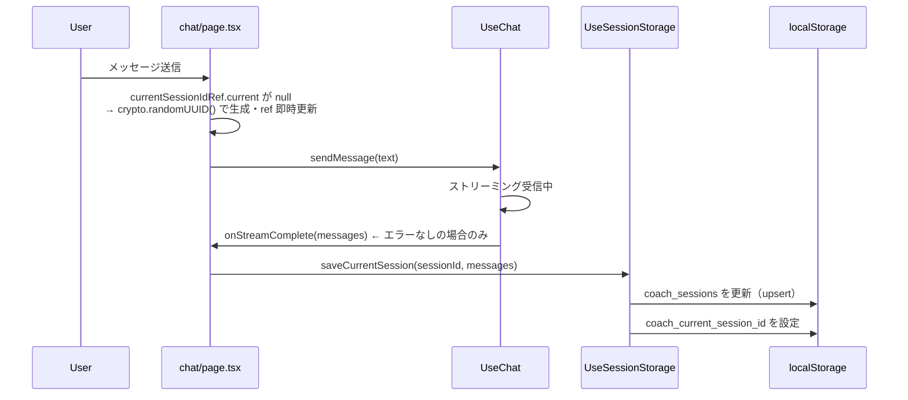
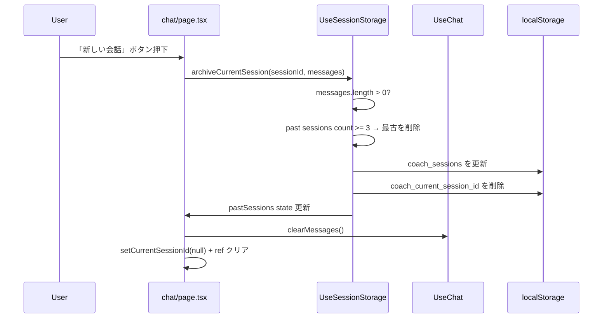
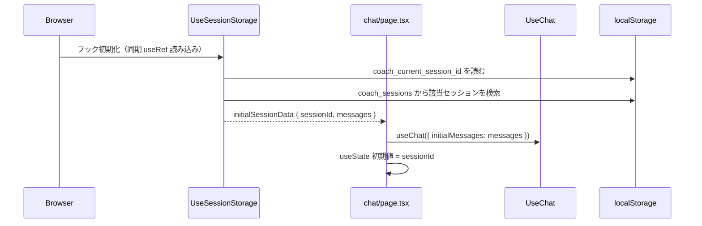

# Design Document: session-history

## Overview

session-history は `chat-core` の上にブラウザの localStorage を使ったセッション永続化とセッション履歴ドロワーを実装する。ページリフレッシュ後の会話復元、最大3セッションの過去履歴一覧、過去セッションの読み取り専用閲覧の3つの主要機能を提供する。

AIとの通信・Markdownレンダリングは chat-core の既存コンポーネントを再利用し、この仕様はセッション管理とドロワーUIのみを担う。`/chat` 単一ページ内で全状態を管理し、URLルーティングは使用しない（ADR-003）。

### Goals

- ページリフレッシュ後に現在のセッションのメッセージを自動復元する（要件1.2）
- 「新しい会話」ボタンでセッションを切り替え、localStorage 上の eviction を管理する（要件2.2, 2.3）
- 過去最大3セッションをドロワーから読み取り専用で閲覧できる（要件3.1–4.4）
- localStorage への書き込みはストリーミング完了後の1回のみ（ADR-002）

### Non-Goals

- AIとの通信処理（`useChat` / `/api/chat` は chat-core が担当）
- メッセージのMarkdownレンダリング（`ChatMessage` を再利用）
- ログアウト時の localStorage 削除
- URLルーティングによるセッションディープリンク（ADR-003）

## Boundary Commitments

### This Spec Owns

- `Session` 型定義
- `useSessionStorage` カスタムフック（localStorage CRUD + eviction）
- ドロワーUI（`SessionDrawer`, `SessionListItem`）
- 読み取り専用モードバナー（`ReadonlyBanner`）
- 「新しい会話」ボタンのUIとevictionロジック
- `useChat` への最小拡張（`initialMessages` オプション・`onStreamComplete` コールバック・`clearMessages` 関数）

### Out of Boundary

- AIストリーミング通信（chat-core の `/api/chat` Route Handler が担当）
- メッセージのMarkdownレンダリング（chat-core の `ChatMessage` を再利用）
- 認証・ログアウト処理（auth スペックが担当）

### Allowed Dependencies

- chat-core: `Message` 型、`useChat`（拡張対象）、`ChatMessage`、`ChatInput`
- auth: NextAuth middleware（直接依存なし、ミドルウェア経由で保護済み）
- `@base-ui/react ^1.6.0`: Dialog コンポーネント（ドロワーUI用、既インストール済み）
- `crypto.randomUUID()`: セッションID生成（ブラウザネイティブ、追加ライブラリ不要）
- Tailwind CSS: スタイリング（既存）

### Revalidation Triggers

- `Message` 型の構造変更（`src/types/message.ts`）→ `Session.messages` への影響を確認
- `useChat` の `messages` 状態の型・構造変更
- localStorage のキー名変更（`coach_current_session_id` / `coach_sessions`）

## Architecture

### Existing Architecture Analysis

チャットページは現在 `useChat` フック1本で `messages`, `isStreaming`, `error`, `sendMessage` を管理している。session-history はこの上に:

- `useSessionStorage` フック（localStorage 永続化）
- `SessionDrawer` / `SessionListItem`（ドロワーUI）
- `ReadonlyBanner`（読み取り専用バナー）

を追加し、`useChat` に後方互換の拡張（`initialMessages` / `onStreamComplete` / `clearMessages`）を加えて統合する。

### Architecture Pattern & Boundary Map



依存方向: `Types → SessionLayer → SessionUI → ChatPage`（上位レイヤーへの import 禁止）

### Technology Stack

| Layer | Choice / Version | Role | Notes |
|-------|-----------------|------|-------|
| Frontend State | React useState / useRef | セッション状態管理 | 既存パターン踏襲 |
| Persistence | localStorage（ブラウザネイティブ） | セッション永続化 | ADR-002準拠 |
| Drawer UI | @base-ui/react ^1.6.0 Dialog | サイドドロワー | 既インストール済み、@radix-ui 不要 |
| ID生成 | crypto.randomUUID() | セッションUUID生成 | 追加ライブラリ不要 |
| Styling | Tailwind CSS | コンポーネントスタイリング | 既存パターン踏襲 |

## File Structure Plan

### Directory Structure

```
src/
├── types/
│   ├── message.ts              # 既存 (chat-core) — 変更なし
│   └── session.ts              # 新規: Session 型定義
├── hooks/
│   ├── use-chat.ts             # 変更: initialMessages / onStreamComplete / clearMessages 追加
│   └── use-session-storage.ts  # 新規: localStorage CRUD + eviction フック
├── components/
│   ├── chat/                   # 既存 (chat-core) — 変更なし
│   │   ├── chat-message.tsx
│   │   └── chat-input.tsx
│   └── session/                # 新規ディレクトリ
│       ├── session-drawer.tsx      # ドロワーUI (@base-ui/react Dialog ベース)
│       ├── session-list-item.tsx   # セッション行（30文字プレビュー）
│       └── readonly-banner.tsx     # 「現在の会話に戻る」バナー
└── app/
    └── chat/
        └── page.tsx            # 変更: セッション管理・ドロワー・読み取り専用モード統合
```

### Modified Files

- `src/hooks/use-chat.ts` — `UseChatOptions` 型と `initialMessages` / `onStreamComplete` / `clearMessages` を追加（後方互換）
- `src/app/chat/page.tsx` — `useSessionStorage` / `SessionDrawer` / `ReadonlyBanner` / 「新しい会話」ボタンを統合

## System Flows

### セッション保存フロー（ADR-002）



### 新しい会話フロー（ADR-001）



### ページリフレッシュ復元フロー



## Requirements Traceability

| 要件 | 概要 | コンポーネント | フロー |
|------|------|--------------|-------|
| 1.1 | ストリーミング完了後に保存 | `useChat`(onStreamComplete), `useSessionStorage`.saveCurrentSession | セッション保存フロー |
| 1.2 | リフレッシュ後復元 | `useSessionStorage`.initialSessionData, `useChat`(initialMessages) | リフレッシュ復元フロー |
| 1.3 | ストリーミング中断時 = 未保存 | `useChat`: onStreamComplete はエラー時に呼ばれない | — |
| 1.4 | エラー時 = 未保存 | `useChat`: onStreamComplete はエラー時に呼ばれない | — |
| 1.5 | ログアウト時保持 | `useSessionStorage` はログアウト操作を購読しない | — |
| 2.1 | 「新しい会話」ボタン常時表示 | `chat/page.tsx` ヘッダー | — |
| 2.2 | 新しい会話アクション | `useSessionStorage`.archiveCurrentSession + `useChat`.clearMessages | 新しい会話フロー |
| 2.3 | Eviction（過去3件超） | `useSessionStorage`.archiveCurrentSession 内 eviction ロジック | 新しい会話フロー |
| 2.4 | ストリーミング中 disabled | `chat/page.tsx`: disabled={isStreaming \|\| messages.length === 0} | — |
| 2.5 | 空セッション disabled | `chat/page.tsx`: disabled={messages.length === 0 \|\| isStreaming} | — |
| 3.1 | ドロワーUI | `SessionDrawer`（@base-ui/react Dialog） | — |
| 3.2 | 最大3件・最新順 | `useSessionStorage`.pastSessions（最新順ソート済み） | — |
| 3.3 | 30文字プレビュー | `SessionListItem` | — |
| 3.4 | 空セッション非表示 | `useSessionStorage`.archiveCurrentSession: messages.length === 0 なら格上げしない | — |
| 4.1 | 選択 → 読み取り専用 | `chat/page.tsx` viewingSession state | — |
| 4.2 | 入力欄非表示 | `chat/page.tsx`: viewingSession !== null → ChatInput を非表示 | — |
| 4.3 | バナー表示 | `ReadonlyBanner` | — |
| 4.4 | 「現在の会話に戻る」 | `ReadonlyBanner`.onReturn → setViewingSession(null) | — |

## Components and Interfaces

### Summary Table

| Component | Domain/Layer | Intent | Req Coverage | Key Dependencies |
|-----------|-------------|--------|--------------|-----------------|
| `useSessionStorage` | Hook | localStorage CRUD + eviction | 1.1–1.5, 2.2–2.3, 3.2, 3.4 | localStorage API, Session 型 |
| `SessionDrawer` | UI | 過去セッション一覧ドロワー | 3.1–3.4 | @base-ui/react Dialog, SessionListItem |
| `SessionListItem` | UI (presentational) | セッション行（30文字プレビュー） | 3.3 | Session 型 |
| `ReadonlyBanner` | UI (presentational) | 読み取り専用バナー | 4.2, 4.3, 4.4 | — |
| `chat/page.tsx` (modified) | Page | セッション管理の統合コーディネーター | 2.1–2.5, 4.1 | すべてのセッションコンポーネント + chat-core |
| `use-chat.ts` (modified) | Hook | チャット状態管理（後方互換拡張） | 1.1, 1.2 | — |

---

### Session Layer

#### useSessionStorage

| Field | Detail |
|-------|--------|
| Intent | localStorage の読み書き・eviction・過去セッション一覧を管理するカスタムフック |
| Requirements | 1.1, 1.2, 1.3, 1.4, 1.5, 2.2, 2.3, 3.2, 3.4 |

**Responsibilities & Constraints**

- localStorage キー `coach_current_session_id` と `coach_sessions` を管理する
- `archiveCurrentSession` は `messages.length === 0` の場合は格上げしない（要件3.4 / ADR-001）
- localStorage 書き込みは `saveCurrentSession` と `archiveCurrentSession` 呼び出し時のみ（ADR-002）
- ログアウト操作を購読せず、localStorage を能動的に削除しない（ADR-002 / 要件1.5）
- `pastSessions` は常に `messages.length > 0` のセッションのみを含む（最大3件、最新順）

**Dependencies**

- External: localStorage Web API — セッション永続化 (P0)
- Outbound: `Session` 型 — データ構造定義 (P0)
- Outbound: `Message` 型 — セッション内メッセージ (P0)

**Contracts**: State [x]

##### Service Interface

```typescript
interface UseSessionStorageReturn {
  // 過去セッション（max 3, 最新順 = createdAt 降順）
  pastSessions: Session[];
  // マウント時に localStorage から同期読み込みされた初期データ
  // null = localStorage に現在のセッションなし（新規ユーザーまたは新しい会話後）
  initialSessionData: { sessionId: string; messages: Message[] } | null;
  // ストリーミング完了後に呼び出す（ADR-002: 1回書き込み）
  saveCurrentSession: (sessionId: string, messages: Message[]) => void;
  // 「新しい会話」押下時: 現在のセッションを格上げ + eviction + currentId クリア
  // messages.length === 0 の場合は格上げせず currentId のみクリア（ADR-001）
  archiveCurrentSession: (sessionId: string | null, messages: Message[]) => void;
}
```

- Preconditions: ブラウザ環境（`typeof window !== 'undefined'`）
- Postconditions: `saveCurrentSession` 呼び出し後、`coach_sessions` に最新メッセージが保存されている
- Invariants: `pastSessions.length <= 3`、`coach_sessions` 内全セッションは `messages.length > 0`

##### State Management

- State model: `pastSessions: Session[]`（React state）、`initialSessionData`（useRef で同期初期化）
- Persistence: `coach_current_session_id: string`、`coach_sessions: Session[]`（JSON）
- Concurrency strategy: 同一ブラウザの同一タブのみを想定（複数タブ同期なし）

**Implementation Notes**

- `initialSessionData` は `useRef` でマウント時1回だけ同期読み込みする（`useState` 初期化関数も可）
- SSR 安全ガード: `typeof window === 'undefined'` の場合は localStorage にアクセスしない
- JSON.parse エラーハンドリング: try-catch で失敗時は空配列として扱い、破損データで画面が壊れないようにする
- Eviction 判定: `archiveCurrentSession` 実行後、過去セッション数が 3 を超える場合は `createdAt` 最小のセッションを削除する

---

### Session UI Layer

#### SessionDrawer

| Field | Detail |
|-------|--------|
| Intent | 過去セッション一覧を表示するサイドドロワー |
| Requirements | 3.1, 3.2, 3.3, 3.4 |

**Contracts**: State [x]

##### Service Interface

```typescript
interface SessionDrawerProps {
  isOpen: boolean;
  onClose: () => void;
  sessions: Session[];            // pastSessions from useSessionStorage
  onSelectSession: (session: Session) => void;
}
```

**Implementation Notes**

- `@base-ui/react` の `Dialog.Root` / `Dialog.Portal` / `Dialog.Backdrop` / `Dialog.Popup` でサイドドロワーを構成する
- `Dialog.Popup` は `fixed left-0 top-0 h-full w-64 bg-white shadow-xl` で左サイドパネルとして表示する
- `sessions.length === 0` の場合は「まだ保存済みの会話がありません」を表示する
- セッション一覧の描画は `SessionListItem` に委譲する

#### SessionListItem (presentational)

```typescript
interface SessionListItemProps {
  session: Session;
  onSelect: () => void;
}
```

**Implementation Notes**

- 最初のユーザーメッセージ（`session.messages.find(m => m.role === "user")`）の `content` を最大30文字で表示する
- 30文字超過時は末尾に `"..."` を付加する
- ユーザーメッセージが存在しない場合は `"（メッセージなし）"` を表示する

#### ReadonlyBanner (presentational)

```typescript
interface ReadonlyBannerProps {
  onReturn: () => void;
}
```

**Implementation Notes**

- 画面上部に `sticky top-0` で固定表示する
- 「現在の会話に戻る」ボタンを含む
- 読み取り専用であることを示すラベル（例: 「過去の会話を表示中」）を添える

---

### Modified: use-chat.ts

後方互換拡張（既存呼び出しへの影響なし）:

```typescript
interface UseChatOptions {
  // マウント時の初期メッセージ（localStorage 復元用）
  initialMessages?: Message[];
  // ストリーミングがエラーなしで完了した後に呼ばれるコールバック
  onStreamComplete?: (messages: Message[]) => void;
}

interface UseChatReturn {
  messages: Message[];
  isStreaming: boolean;
  error: string | null;
  sendMessage: (text: string) => Promise<void>;
  clearMessages: () => void;  // 追加: 「新しい会話」時のリセット用
}

export function useChat(options?: UseChatOptions): UseChatReturn
```

**Implementation Notes**

- `initialMessages` は `useState<Message[]>(options?.initialMessages ?? [])` の初期値として使用する
- `onStreamComplete` はストリーミングが `error` なし（`error === null`）で完了した時点で、最新の `messages` を引数にして呼び出す
- `clearMessages`: `setMessages([])` と `messagesRef.current = []` を同時にリセットする

---

### Modified: chat/page.tsx

追加する state と ref:

```typescript
// セッションID（null = まだメッセージを送っていない空の状態）
const currentSessionIdRef = useRef<string | null>(initialSessionData?.sessionId ?? null);
const [currentSessionId, setCurrentSessionId] = useState<string | null>(
  () => initialSessionData?.sessionId ?? null
);
// 読み取り専用モードで閲覧中のセッション
const [viewingSession, setViewingSession] = useState<Session | null>(null);
// ドロワー開閉状態
const [isDrawerOpen, setIsDrawerOpen] = useState(false);
```

メッセージ送信ラッパー（stale closure 対策）:

```typescript
const handleSendMessage = async (text: string) => {
  if (!currentSessionIdRef.current) {
    const id = crypto.randomUUID();
    currentSessionIdRef.current = id;  // ref を即時更新
    setCurrentSessionId(id);           // state は非同期更新
  }
  await sendMessage(text);
};
```

「新しい会話」disabled 条件:

```typescript
const isNewChatDisabled = isStreaming || messages.length === 0;
```

表示切り替えロジック:

```typescript
// 読み取り専用モード中は viewingSession のメッセージを表示
const displayMessages = viewingSession ? viewingSession.messages : messages;
```

## Data Models

### Session 型

```typescript
// src/types/session.ts
import type { Message } from "@/types/message";

export interface Session {
  id: string;           // crypto.randomUUID() で生成（最初のメッセージ送信時）
  createdAt: number;    // Date.now() — eviction の優先度に使用
  messages: Message[];  // chat-core の Message 型を参照
}
```

### localStorage スキーマ

| キー | 型 | 説明 |
|------|----|------|
| `coach_current_session_id` | `string` | 現在の活性セッションID。「新しい会話」時に削除 |
| `coach_sessions` | `Session[]`（JSON文字列） | 全セッション配列。最大4件（過去3件 + 現在1件） |

**Invariants**:
- `coach_sessions` 内の全セッションは `messages.length > 0`
- `coach_sessions.length <= 4`（過去3件 + 現在活性1件）
- `coach_current_session_id` が指すセッションは `coach_sessions` に存在する（不整合時は空セッションとして扱う）

## Error Handling

### エラーカテゴリと対応

| エラー | 対応 | 要件 |
|--------|------|------|
| localStorage 書き込み失敗（容量超過等） | try-catch でサイレント失敗。チャット機能は継続 | 1.1 |
| localStorage 読み込み失敗（JSON 破損） | try-catch で空データとして扱い、最初から開始 | 1.2 |
| Gemini ストリーミングエラー | `onStreamComplete` を呼ばない → 書き込みなし | 1.3, 1.4 |
| `coach_current_session_id` は存在するが sessions に該当なし | 不整合として `initialSessionData = null` で扱う | 1.2 |

## Testing Strategy

### Unit Tests（useSessionStorage）

- `saveCurrentSession`: メッセージを localStorage に正しく保存する（要件1.1）
- `archiveCurrentSession`: `messages.length === 0` のセッションは格上げしない（要件3.4）
- `archiveCurrentSession` Eviction: 過去セッション3件の状態で呼ぶと最古が削除される（要件2.3）
- `initialSessionData`: localStorage に既存セッションがある場合、初期データが返される（要件1.2）
- JSON パース失敗時: 例外を投げず空セッション一覧として扱われる

### Unit Tests（use-chat.ts 拡張）

- `initialMessages` 指定時: `messages` の初期値が指定値になる（要件1.2）
- `onStreamComplete`: ストリーミング完了後（エラーなし）に呼ばれる（要件1.1）
- `onStreamComplete`: Gemini エラー発生時は呼ばれない（要件1.3, 1.4）
- `clearMessages`: 呼び出し後に `messages` が空配列になる（要件2.2）

### Component Tests（React Testing Library）

- `SessionListItem`: 最初のユーザーメッセージ30文字超過時に `"..."` が付加される（要件3.3）
- `SessionListItem`: ユーザーメッセージがない場合に `"（メッセージなし）"` を表示する
- `SessionDrawer`: `sessions` が空配列の場合に空状態メッセージを表示する
- `ReadonlyBanner`: 「現在の会話に戻る」ボタンクリックで `onReturn` が呼ばれる（要件4.4）

### Integration Tests（chat/page.tsx）

- 読み取り専用モード中: `ChatInput` が非表示、`ReadonlyBanner` が表示される（要件4.2, 4.3）
- 「新しい会話」ボタン: `isStreaming=true` の場合 disabled（要件2.4）
- 「新しい会話」ボタン: `messages.length=0` の場合 disabled（要件2.5）
